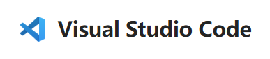
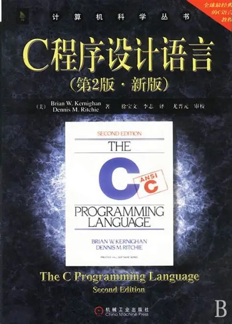
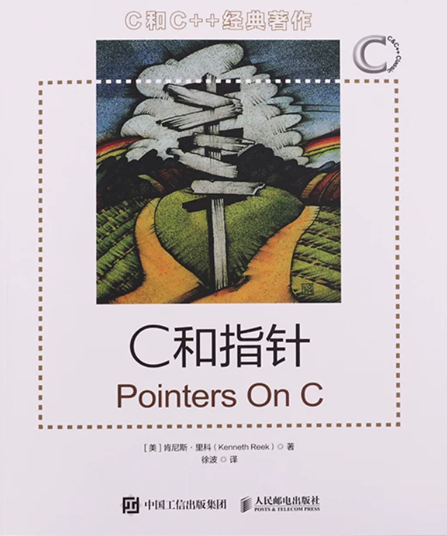

# C 语言学习

C 语言是电控组的根基：STM32 固件、电机控制、操作系统内核全部用 C 编写，它也是入队培训的第一道门槛。本章不讲语法本身，而是把环境配置和资料选型一次说清。**关于学习，建议控制在一个月以内，学习基本语法和各种C语言特性，包括但不限于指针，内存，结构体等等**

==学习任何一门编程语言，都是在项目中精进的，在实际问题中边解决问题边学习 ，光对着教程敲一百遍也很难掌握好==，所以在教程学习了一段时间后，建议结合具体的小项目，在B站找具体的开源代码，到github上拉去一个项目看结构化的工程是如何编写的

!!! warning "关于 AI 辅助"
    学习阶段建议把 AI 编程工具仅当作辅助，甚至完全不用：每一行代码都要亲自敲。过度依赖 AI 会造成"能力错觉"——看似什么都能做，实际基础并没有掌握。C 语言作为最底层的基础，必须建立在自己的脑子里。

## 环境配置

- **[Visual Studio Code](https://code.visualstudio.com/)（简称VScode）— 前期学习推荐**。轻量免费，装 C/C++ 插件 即可运行。PS：注意区分VS Code 和 Visual Studio，VScode更轻量更易于扩展，Visual Studio集成开发环境更"重"目前暂不推荐

  {: style="float:left;zoom:67%" }

- [CLion](https://www.jetbrains.com/clion/) — 后期涉及 CMake 组织的复杂工程时再换，学生认证可免费使用。

**环境配置的教程请在B站搜索**，跟着教程在Vscode上敲出你的第一个C语言程序吧

> 有疑难杂症或者不懂得可以在培训群里面交流

## 教程推荐

> 这里仅列举教程，具体根据个人喜好，风格节奏。不要太纠结于谁的教程更好，任何一个知识点完善体系化不出错的教程都能使你受益匪浅

### 视频教程：

[B 站搜索：C语言入门教程](https://search.bilibili.com/all?keyword=C语言入门教程)即可，任选一个播放量高、时长适中的系列跟完即可，不必纠结选哪个。

- [浙江大学 翁恺《C 语言》](https://www.bilibili.com/video/BV1dr4y1n7vA) — 大学公开课风格，讲解细致，适合喜欢课堂节奏的人。
- [黑马程序员C语言零基础入门到精通全套视频教程](https://www.bilibili.com/video/BV1Xa4y1k7LU?p=93&vd_source=0ec807ca37217dda15dcd3c1863ba0c9) — 适合跟着手把手敲，内容详细，风格看个人喜好

上述仅示例，具体看个人喜好

{: style="float:left;zoom:33%" }

### 网页教程

这里推荐一个[菜鸟教程 C 语言](https://www.runoob.com/cprogramming/c-tutorial.html) — 篇幅短、只讲核心，适合快速入门或复习查阅。

### 书籍教程

- **《C 程序设计语言》**（K&R）— C 语言设计者撰写，篇幅小、质量极高，建议作为入门书籍。

{: style="float:left;zoom:33%" }

- 《C 和指针》— 指针与内存专题的经典黑皮书，把最难啃的部分单独讲透，后期学习推荐目前不必深入。

{: style="float:left;zoom:25%" }

* 还有一本C primer plus，不过体量太大不建议拿来学习，可以当成字典查阅深入某一部分知识

电子版可通过 Zlibrary 获取（见"如何寻找资源"章）。

==无论任何方式学习，比起高中拿笔记本记录知识点（当然不建议），这里更希望你能打开IDE一行一行的敲代码去理解==

> 不懂的知识点可以尝试询问AI，但切记不要让AI帮你写代码！！！

## 查阅手册

- [cppreference 中文站](https://zh.cppreference.com) — C/C++ 标准库权威参考，随用随查。

## 补充

关于学习程度，这里建议学到重点吃透指针与内存模型即可，同时，最好能补上一些计算机基础的相关知识，这里补上一些相关资料，后期学习过程建议观看，这一部分并不是重点，但对于你理解底层会很有帮助

* [C语言的编译过程详解 - 知乎](https://zhuanlan.zhihu.com/p/558783902)

* [隐藏的细节：编译与链接](https://www.bilibili.com/video/BV1TN4y1375q?vd_source=0ec807ca37217dda15dcd3c1863ba0c9)

* [从计算机底层认识指针！深入理解C语言指针！](https://www.bilibili.com/video/BV1o8411T7K5?vd_source=0ec807ca37217dda15dcd3c1863ba0c9)

* [一行C代码如何变成.exe？带你手撕可执行文件的底层逻辑！](https://www.bilibili.com/video/BV1rapozTEDr?vd_source=0ec807ca37217dda15dcd3c1863ba0c9)

* [C语言中内存布局(内存模型)是怎样的? - freshman_xy - 博客园](https://www.cnblogs.com/freshman-y/p/18780970)

* [彻底弄懂C/C++内存布局/分段 | 堆 栈 静态内存](https://www.bilibili.com/video/BV1Sepyz7ECL?vd_source=0ec807ca37217dda15dcd3c1863ba0c9)

* [【中科大RM电控合集】浅析gcc, make, cmake](https://www.bilibili.com/video/BV1EWWxedERN?vd_source=0ec807ca37217dda15dcd3c1863ba0c9)

