# Ozone 调试方法

Ozone 是 Segger 出品的独立调试上位机，队内统一使用 Ozone 进行调试。本章是队内整理的完整上手文档。

## 环境配置

官网安装ozone：

[Ozone – The Performance Analyzer](https://www.segger.com/products/development-tools/ozone-j-link-debugger/)

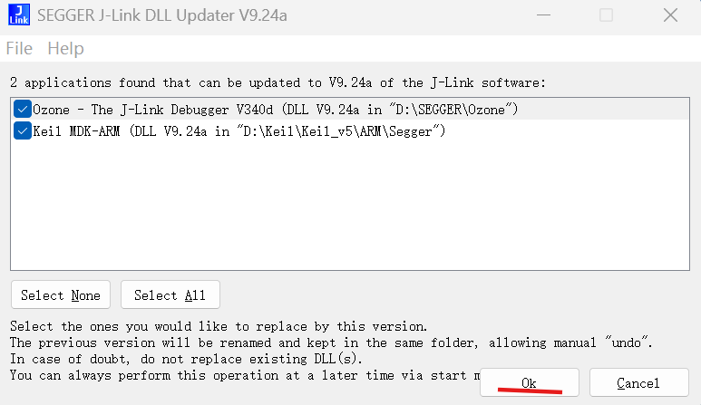{: style="zoom:67%" }

这里需要SEGGER的Jlink软件，若没有请下载：

[SEGGER - The Embedded Experts - Downloads - J-Link / J-Trace](https://www.segger.com/downloads/jlink/)

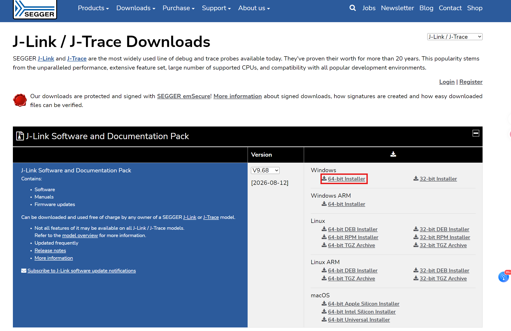{: style="zoom:33%" }

## Ozone使用

> 以下项目仅举例。芯片型号，项目路径，配置文件和代码内容和你们自己的项目一般不一致

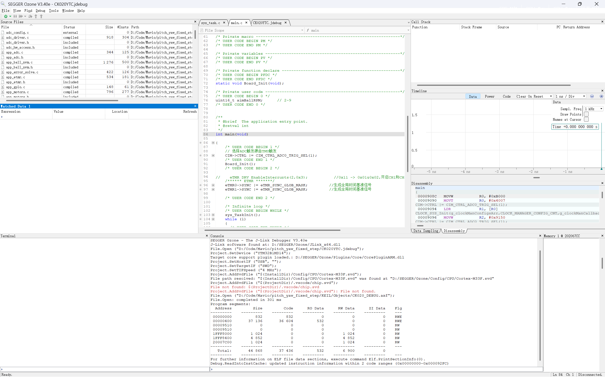

烧录是左上角的绿色按钮，变为红色说明在调试当中，这里支持单步执行，重启，步过等操作

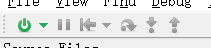

> 若没有连接上Jlink，请按如下操作：
>
> 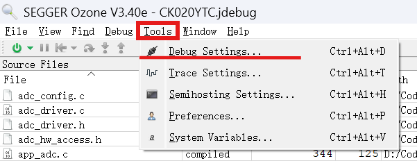{: style="zoom:67%" }
>
> 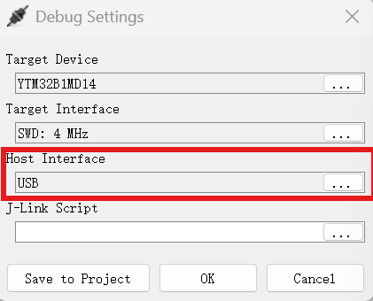{: style="zoom:67%" }
>
> 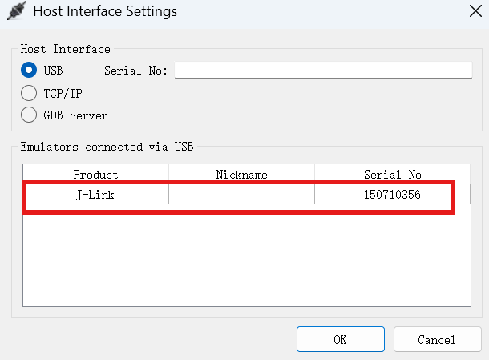{: style="zoom:50%" }
>
> 这里若白框中没有任何的选项，说明没有连接上Jlink

## 窗口介绍

左上角View选择开启对应的窗口，重要的窗口如下：

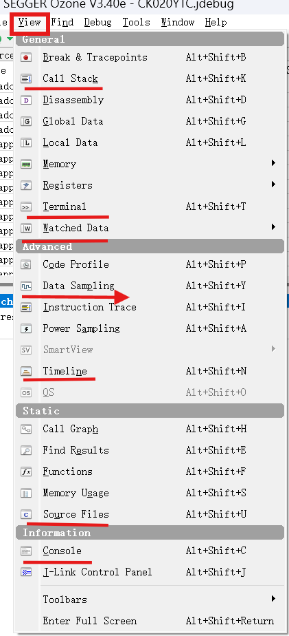{: style="zoom:50%" }

---

* Call Stack：可以在暂停时看到当前函数的调用链，如果卡死了可以从当前函数往前追溯，看依次调用了哪些函数跑到了当前这一步

	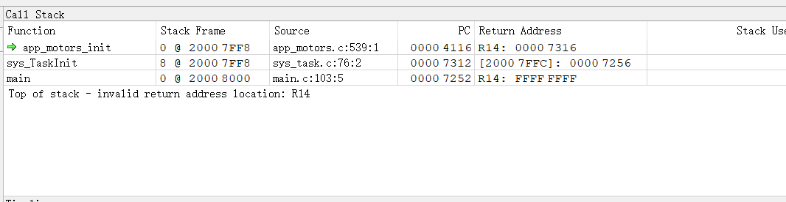{: style="zoom:67%" }

* Terminal：顾名思义，但不是当前电脑的终端，是相对于MCU的终端，这里可以看到**日志系统**（参考项目里的文档）打印的日志

* Watched Data：和keil的watch窗口一样，对代码里面某个变量双击选择并右键选择Watch后可在这里查看

  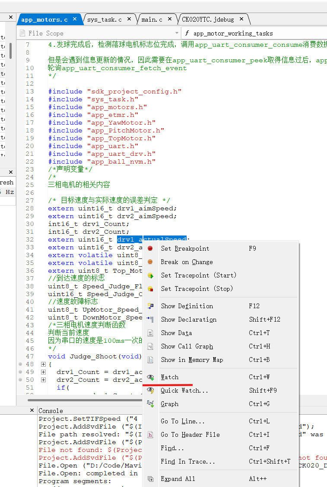{: style="zoom:50%" }

  注意一定要右键选择Refresh Rate为1-5Hz，不然这个值不会自动更新。双击Value下面的值，可以直接修改赋值，和Keil类似

  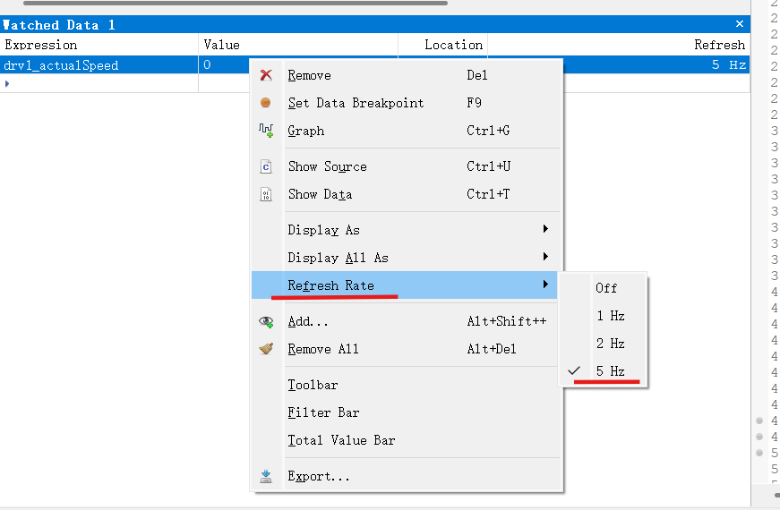{: style="zoom:50%" }

* Console：烧录相关的信息在这里面，这里可以看到烧录是否成功

	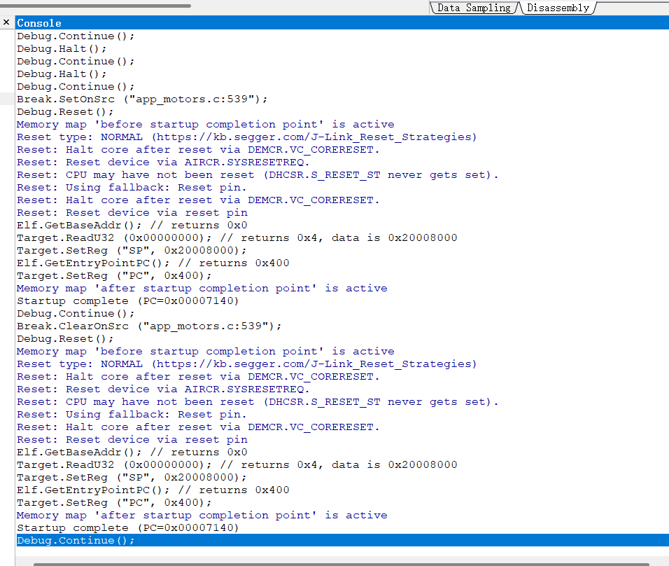{: style="zoom:50%" }

* Data Sampling：图表采样的数据，和watch功能类似实时观看变量的值，配合Timeline使用，可以导出csv文件，

* Timeline：对于在Watched Date里面的数据，右键后选择Graph，可以添加到这个窗口，可以实时查看变量的曲线值

	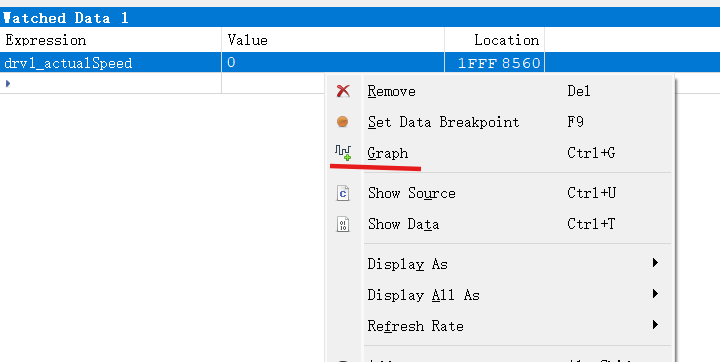{: style="zoom:50%" }

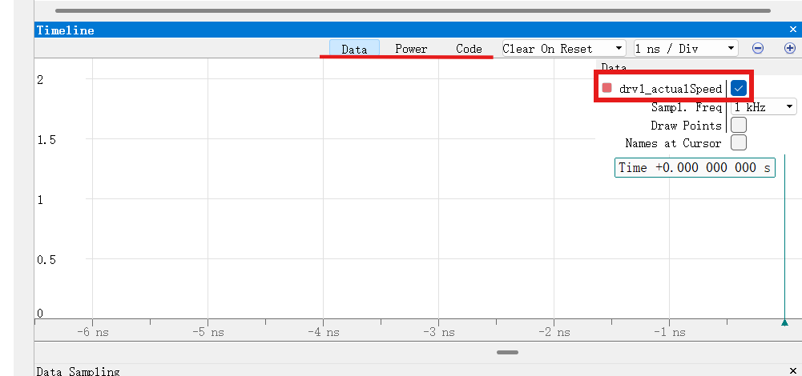{: style="zoom:50%" }

右键空白区域，调整曲线的时间宽度和数值高度

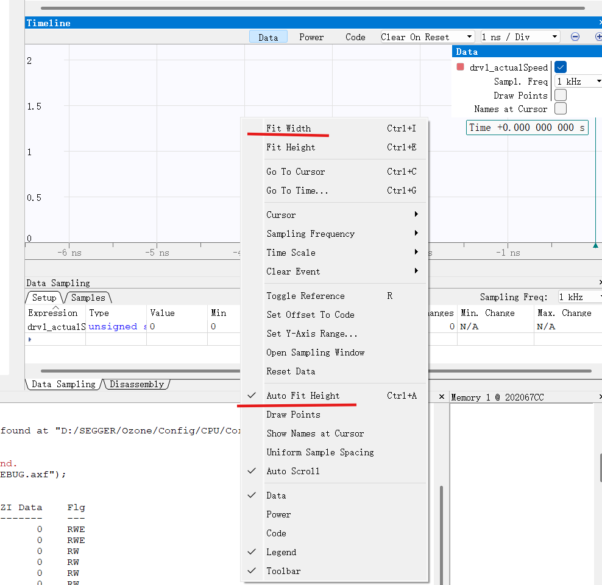{: style="zoom:50%" }

timeline的强大之处就在于，不需要接串口并用VODF等工具去看曲线，只需要这一个调试软件，就可以实现烧录，断点调试，查看变量值，实时修改变量值，按时间轴绘制曲线变量的值

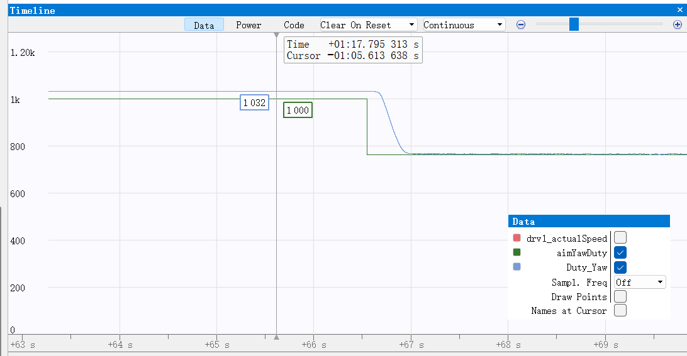{: style="zoom:50%" }

这里Sampl.Freq改成off可以暂停下来看，改成对应的Hz代表对数值的采样频率，频率越高曲线越平滑，但对性能要求也更高（一般1kHz也够用了）

* Source Files：和keil类似，打开对应的源代码文件，显示在中间，在源代码中找到对应的变量值进行观察，或者在侧边打上断点，注意：不能打开的源文件里面修改代码！

## 注意事项：

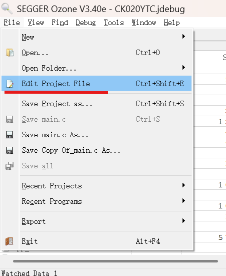

有异常（比如打不开烧录的源文件）在这里更改ozone的配置文件

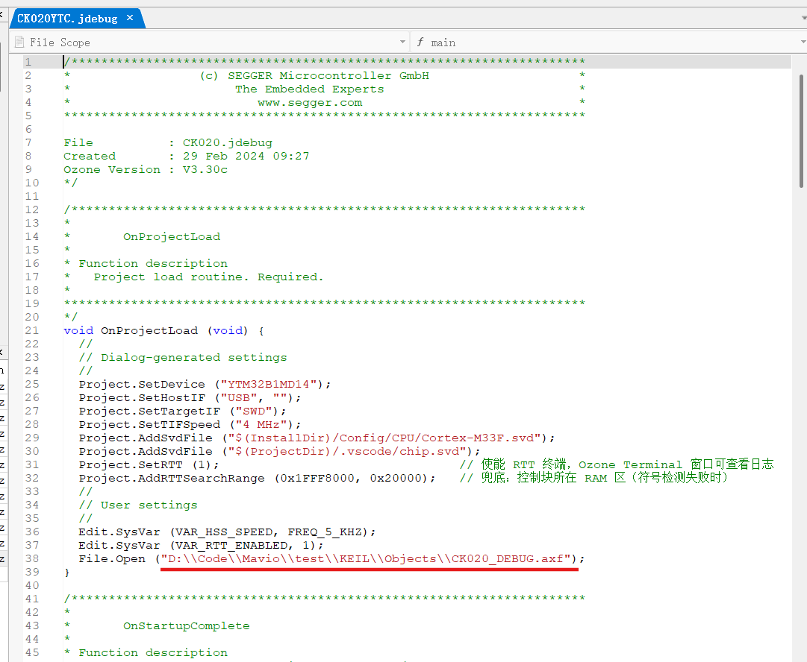

这里是要烧录的二进制文件的位置，当前是一个绝对路径，请修改成自己的文件的位置，或者改成相对路径：

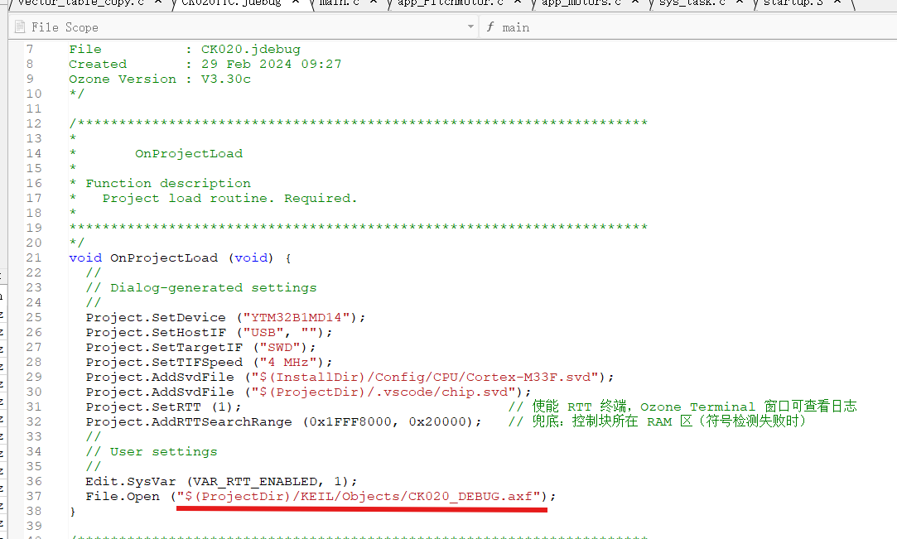

**烧录**就是把一个二进制文件（一般后缀为axf或elf）通过烧录器写进芯片里面的flash，所以整个调试器相当于把这个文件写进芯片里，所以千万不要选错！

同时，当前的工作流程是：

1. **在vscode/keil里面编辑代码**
2. **在keil当中build代码，每次修改后一定要build！！因为build修改的文件就是这个"CK020_DEBUG.axf"文件**
3. **用ozone烧录代码进行调试，这里烧录的就是keil编译的axf文件**

更多教程：

[ozone 单片机debug调试软件 使用教程_ozone使用教程-CSDN博客](https://blog.csdn.net/2301_80317548/article/details/138198409)

[[转\] [Ozone] Ozone使用介绍-基础功能 - ramlife - 博客园](https://www.cnblogs.com/ramlife/articles/12222396.html)
