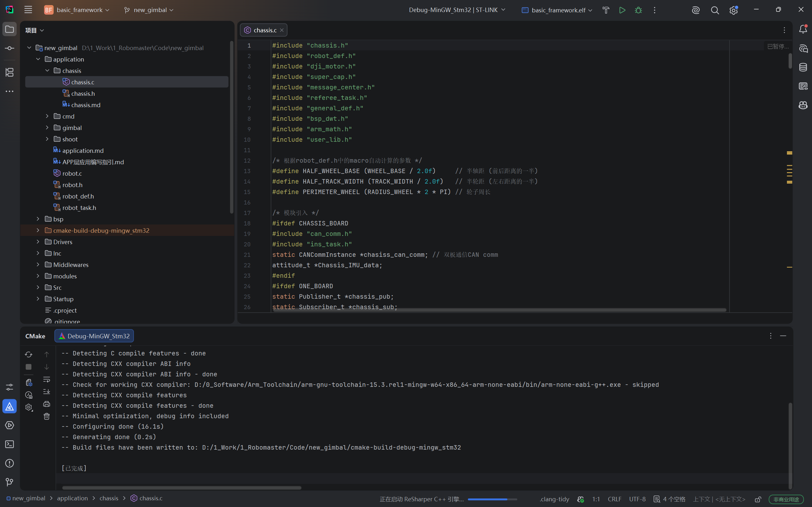
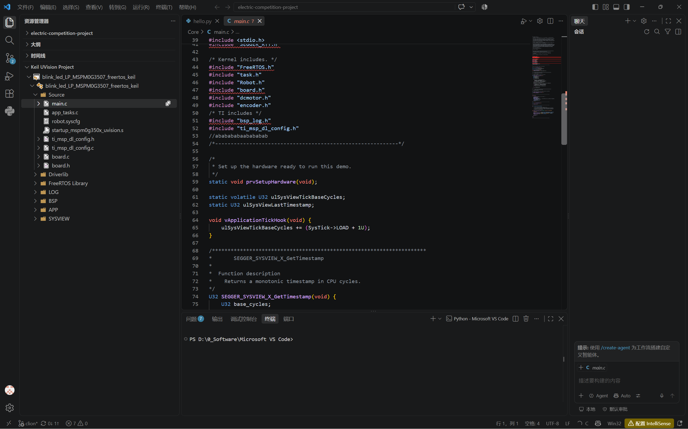
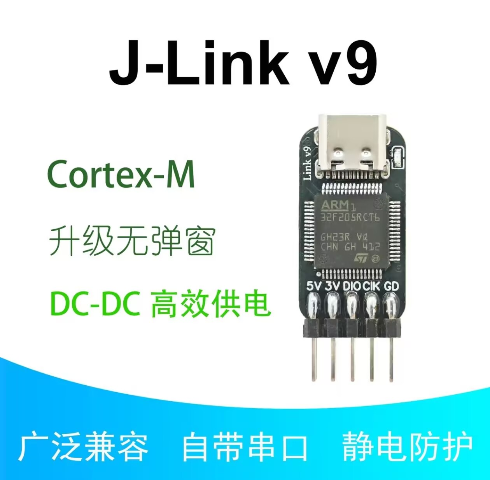

# 开发方式

单片机开发的完整工具链由三部分组成：**代码编写**（编辑器/IDE + 编译工具链）、**烧录**（把固件下载进芯片）、**调试**（调试器 + 调试上位机）。方案没有绝对的优劣，本章给出当前主流的组合与适配关系。

> **省流：推荐使用 CLion + J-Link + Ozone。CLion 负责编写和构建代码，J-Link 负责连接与下载，Ozone 负责调试。**

## 代码编写

### 推荐方案：==CLion==

- [CLion](https://www.jetbrains.com/clion/) — 对 CMake 工程支持最好；STM32CubeMX 可直接生成 CMake 工程，配合 `arm-none-eabi-gcc` 工具链编译。JetBrains 学生认证免费。
- 具有良好的代码跳转、重构、CMake 和 Git 集成体验，适合从入门学习延伸到队内项目协作。
- 首次使用需配置 CMake 和 `arm-none-eabi-gcc` 工具链，按照站内 [CLion 安装与配置教程](install-clion.md) 完成一次配置后即可持续使用。

[爽！手把手教你用CLion开发STM32【大人，时代变啦！！！】](https://www.bilibili.com/video/BV1pnjizYEAk?vd_source=0ec807ca37217dda15dcd3c1863ba0c9)

[【中科大RM电控合集】CLion-armgcc开发环境配置教学](https://www.bilibili.com/video/BV1Rx4y1C7d4?vd_source=0ec807ca37217dda15dcd3c1863ba0c9)

{: style="zoom:50%" }

### 备选方案：==VS Code + Keil==

> 由于keil的界面过于远古，代码编辑体验也不如现代的IDE好，所以keil不建议拿来编辑代码（虽然许多教程都这么做的）

- **Keil 本身只当“编译烧录器”，代码编辑交给 VS Code**。
- 该方案资料较多、配置相对直接，可用于学习依赖 Keil 的传统教程，或维护现有 Keil 工程。

[2026年了，这才是嵌入式开发环境的最优解！！](https://www.bilibili.com/video/BV1vED9BqEiJ?vd_source=0ec807ca37217dda15dcd3c1863ba0c9)

[【中科大RM电控合集】手把手Keil+STM32CubeMX+VsCode环境配置](https://www.bilibili.com/video/BV1bU4y1D7nJ?vd_source=0ec807ca37217dda15dcd3c1863ba0c9)

{: style="zoom:50%" }

### 传统方案：Keil MDK5

- [Keil MDK5](https://www.keil.com/mdk5/) — 传统单片机 IDE，编写、编译、烧录、调试一体，网上教程与历史工程模板最多。

> 这里其实还有一种STM32CubeIDE，ST公司官方的集成IDE，不推荐，虽然编写调试配置方便，但只针对ST公司的芯片，如果迁移平台则无法使用，建议还是用上述的通用方案

## 调试方式

- **Keil 在线调试** — 断点、单步、观察变量与外设寄存器视图，与现有 Keil 工程无缝衔接。
- ==**[Ozone](https://www.segger.com/products/development-tools/ozone-j-link-debugger)**== — Segger 出品的独立调试上位机，免费使用，支持实时变量监视、波形、指令级分析，配合 **J-Link** 体验最佳；**队内现用方案**。
- VSCode + Cortex-Debug 插件（基于 OpenOCD/pyOCD）。

!!! note
    调试带实时性的代码（如电机闭环）时断点会破坏时序，此时优先用串口打印/波形，见[其他调试工具](debug-tools.md)章。

## 适配的调试器

### ==J-Link==

Segger 出品（[产品页](https://www.segger.com/products/debug-probes/j-link)），性能与功能三者中最强：下载速度快、支持实时变量与指令级分析。**使用 Ozone 调试必须搭配 J-Link**，这是队内现用组合。

连接方式统一为 **SWD**（SWDIO、SWCLK、GND，可选 3.3V 供电），RM 开发板（C 板）上预留了 SWD 排针，接上即可。

购买链接推荐：

* 【淘宝】7天无理由退货 https://e.tb.cn/h.8m3ZY7cJEusis8y?tk=GKkeTfJI3y8 MF287 「JLINK V9 调试器下载器TYPE-C接口STM32烧录」 点击链接直接打开 或者 淘宝搜索直接打开 （推荐，体积小巧，接口不容易松动）

  {: style="zoom:25%" }

* Jlink-V9 ARM仿真器，任意挑选商家购买即可，注意价格不要太便宜，40-100为正常区间

  {: style="zoom:25%" }

### ST-Link

价格便宜，STM32 全系支持，配合 Keil / STM32CubeIDE  使用。

### DAP-Link

开源的 CMSIS-DAP 标准调试器，可支持无线调试，前期不建议折腾，建议使用上述两种方案。

> 本质上，**任何调试器的目的都是把编译的elf/axf二进制文件，写进开发板的芯片内部**，这个概念必须理解！！后续烧录遇到的问题，都排查：
> 硬件接线、二进制文件是否选择正确、是否正确编译、芯片型号是否选对、程序起始位置是否选对
