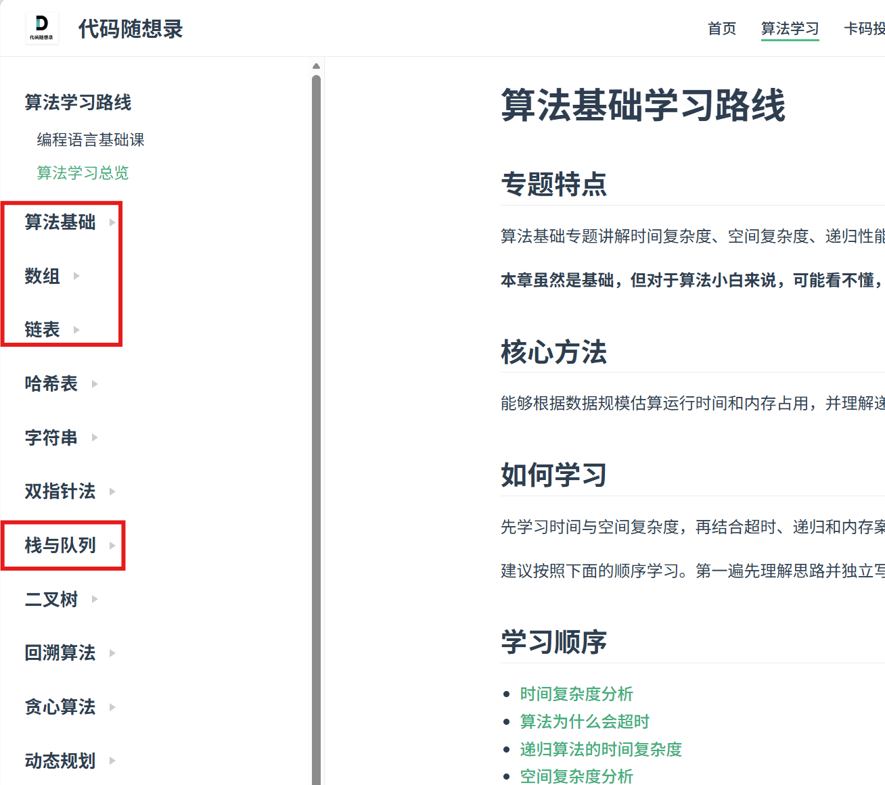

# 数据结构与算法

**这部分内容暂且来说重要性和紧急性不大，**但在后续代码当中，FreeRTOS 的任务链表、串口接收的环形缓冲区、模式切换的状态机，都会或多或少用到，这里贴出来或许不适合初学的你，但在日后想要精进编程语言功底还是希望能想起来这一部分的内容

数据结构与算法是编程能力的基本功，需要长期积累。

## 资源教程

### 视频资源

这里同理，B站自行搜索，注意学习的内容关注到数组，链表，栈堆等即可，后续哈希，树，图等内容其实用不太上

### 纸质书籍

* **《大话数据结构》**：这一本其实也完全够了，讲解通俗易懂，非常适合入门，也很能读下去

{: style="zoom:33%" }

**建议学到第四章即可**；树，图之类的内容了解即可一般用不上

### 网页资源

[算法基础学习路线 | 代码随想录 | 代码随想录-全网最全算法数据结构刷题学习路线|图文+视频教程|免费开源](https://programmercarl.com/algo/fundamentals/)

{: style="zoom:33%" }

建议关注如上红框圈选的内容，同时这里配套了力扣刷题，这里练练手都行但不建议花时间）

## 嵌入式方向的应用

- 链表 — FreeRTOS 内核的任务调度大量使用，以及队内框架代码pub-sub机制也运用链表。
- 队列 / 环形缓冲区 — 串口不定长数据接收的标准做法。
- 状态机 — 遥控器模式切换、发射机构流程控制的惯用写法，综合项目会实际用到。

## 其他

实际上，在自学过程中这部分完全可以根据需要才学，而不是什么都掌握了再去开始做项目，

这部分你一定会觉得，哪里可以用的上？

**虽然说一开始可能不重要或者用不上，但是数据结构和算法很多的思想是非常值得学习的，比如如何写一段高效率且简洁的代码，针对不同的问题会有很多思路去解决，也有运行效率上的优劣之分**

总之，对于基础学习者来说，这一部分可以不必深究，但是对于想要精进编程语言功底，数据结构算法还是不可或缺的
