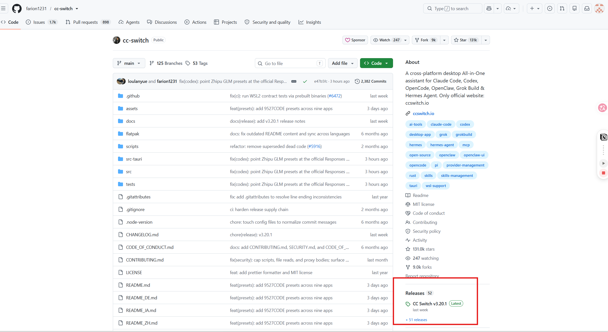
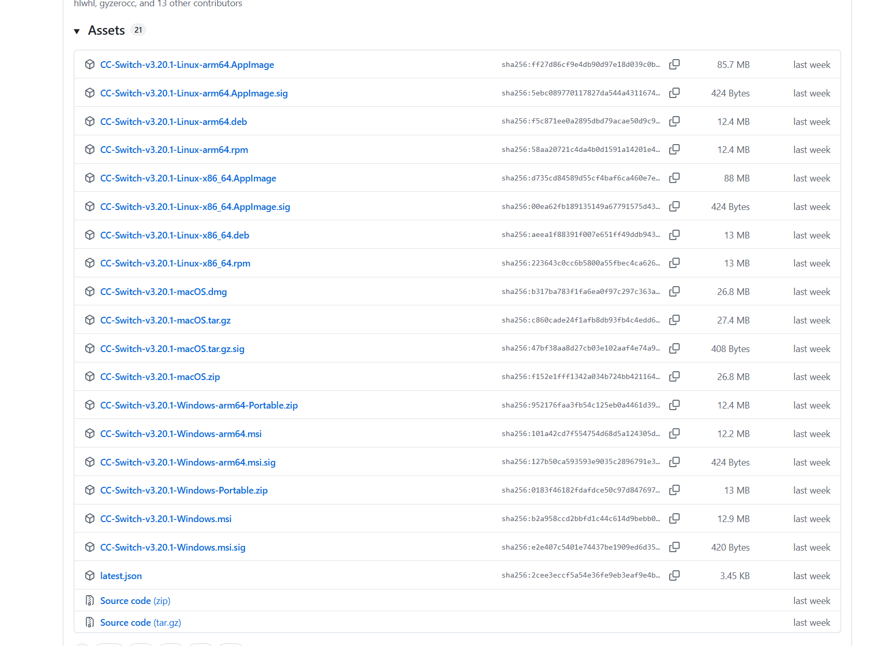

# 如何配置软件环境

{: style="zoom:50%" }

这些或许是你们将来可能会用到的软件（仅举例），总而言之，配置软件以及一些环境或许是最基础也是最容易难倒初学者的第一关

当然，目前阶段最终要的就是配置如下软件环境：

* **Vscode**

* **Stm32CubeMX**

* **Keil 5**

在后续的过程中，以及当前队内的开发方式，都已改成了：

* **Clion**

* **ozone**

其他软件按个人以及实际需求下载配置

---

请自行到B站搜索相关的软件下载，配置教程

==注意原则：任何软件，都是优先到官网下载安装！！！==

> 以上软件Keil和Solidworks之类的也许要破解，这里给你们一个神秘链接：
>
> [Keil uvision5 MDK 5.42简体中文安装包下载 - 考拉软件](https://www.rjctx.com/71490.html)
>
> 这个网站还有很多其他你想要的软件，当然，B站还有很多的资源教程以及网盘链接，注意甄别，提高安全意识同时也避免下载到流氓资源
>
> 当然，有能力还是强烈建议支持正版，以上资源仅供学习交流阶段使用，同时，合工大官网也有部分软件正版资源可以下载(虽然看起来有价值的只有Matlab...)，具体路径为：合肥工业大学官网 — 右上角信息门户 — 下方业务系统 — 软件正版化

---

这里，建议了解一些概念：

[Windows 中的环境变量（Windows11 为例）_win11环境变量-CSDN博客](https://blog.csdn.net/weixin_65032328/article/details/136580118)

[软件安装的过程中都做了些什么?_软件安装的过程是在干什么-CSDN博客](https://blog.csdn.net/Ftworld21/article/details/12718889)

在安装软件的时候，常常有如下推荐渠道：

1. 官网安装，一般会获得installer.exe这种类似的文件，也是最常见的安装方式，根据程序指引安装即可

2. Github开源平台，许多软件并没有直接的官网或者下载安装程序，而是都通过github源码平台托管：

{: style="zoom:50%" }

在打开的发行版本页往下，Assets页面下有许多包

{: style="zoom:50%" }

这里看文件名称，有Linux，macOS，Windows平台下的内容，你可以通过两种方式安装：

* 下载后缀为 .msi 的版本，打开即为常见的安装引导程序，跟着程序安装即可
* 下载后缀为 .zip、.7z 的压缩包，解压后即为源码文件，这里若里面有对应程序的exe，则**通过exe打开软件即可**（你可以根据名称，图标判断），若是类似编译器，工具链类似的，那么请**把bin文件夹加入系统的环境变量**

3.通过B站/资源网站下载百度网盘链接（不推荐，一方面资源来源不清晰不安全，另一方面内置破解压缩等注册机或者dll文件会被系统误杀，安装破解比较麻烦）

