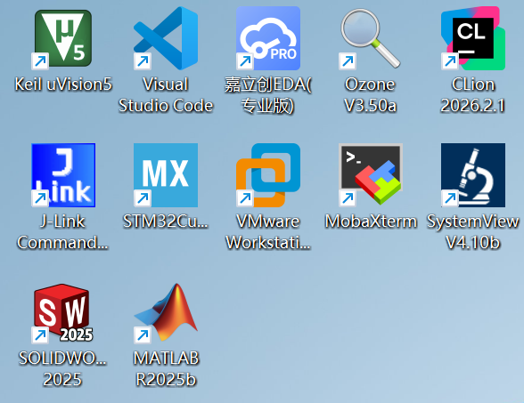

# 如何配置软件环境

{: style="zoom:50%" }

这些或许是你们将来可能会用到的软件（仅举例），总而言之，配置软件以及一些环境或许是最基础也是最容易难倒初学者的第一关

当然，目前阶段最终要的就是配置如下软件环境：

* **Vscode**

* **Stm32CubeMX**

* **Keil 5**

在后续的过程中，以及当前队内的开发方式，都已改成了：

* **Clion**

* **ozone**

其他软件按个人以及实际需求下载配置

---

请自行到B站搜索相关的软件下载，配置教程

==注意原则：任何软件，都是优先到官网下载安装！！！==

> 以上软件Keil和Solidworks之类的也许要破解，这里给你们一个神秘链接：
>
> [Keil uvision5 MDK 5.42简体中文安装包下载 - 考拉软件](https://www.rjctx.com/71490.html)
>
> 这个网站还有很多其他你想要的软件，当然，B站还有很多的资源教程以及网盘链接，注意甄别，提高安全意识同时也避免下载到流氓资源
>
> 当然，有能力还是强烈建议支持正版，以上资源仅供学习交流阶段使用，同时，合工大官网也有部分软件正版资源可以下载(虽然看起来有价值的只有Matlab...)，具体路径为：合肥工业大学官网 — 右上角信息门户 — 下方业务系统 — 软件正版化
