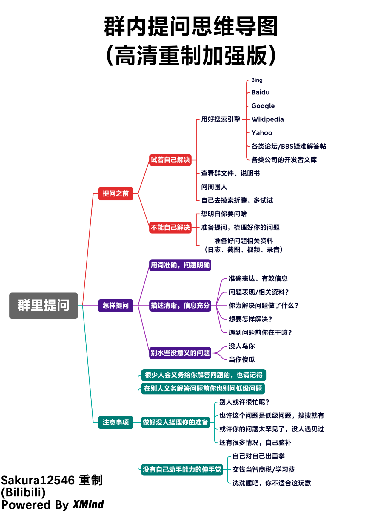
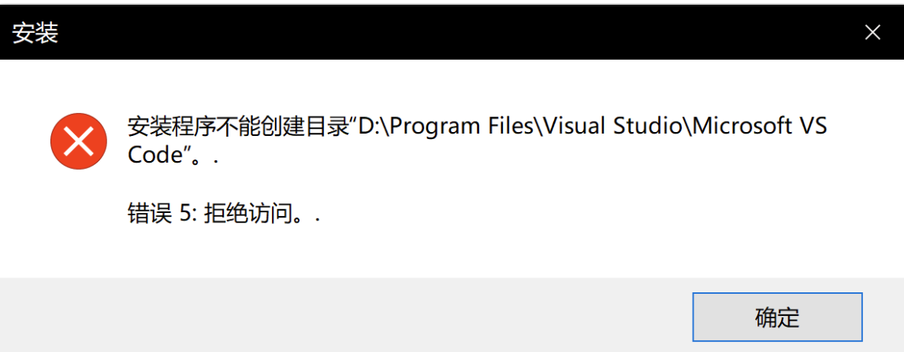
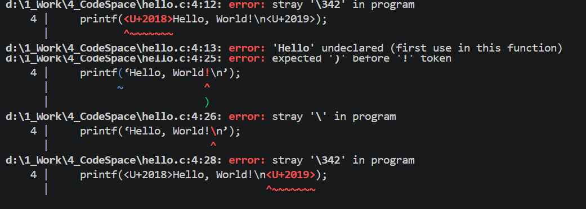

# 如何解决问题以及提问

鉴于很多人会有非常基础、很轻松就能解决的问题，但还是在培训群里甚至私聊问——这一部分**请务必观看**，这或许是前期学习阶段最重要的内容。

当然，还是**欢迎大家积极提问**，本文并不是吓唬你们要多么多么严谨，我们可以体谅很多人的基础不好，遇到问题也不要怕群里人笑话

图片省流:

{: style="zoom:50%" }


## 遇到问题，该怎么办

这里说的问题有很多种，打个比方：在后面教程中配置环境时提示报错、出现故障，或者不知道该选什么;在编写语言的时候，遇到报错，或者对一些语法有疑问


这个时候，你应该首先想到三个东西：**浏览器、哔哩哔哩、AI**。

### 为什么不万事问 AI？

确实效率很高，但 AI 存在的问题在于：**有幻觉以及盲目性**——它的解答不一定正确，但它默认它的解答是没有问题的。

当然，也有一部分原因是你描述不清楚问题：三言两语就让它解决你的问题，可它连你的背景、报错、日志、环境什么都不清楚。

所以，这里也有必要培养**上网自行查资料**的能力。

### 举个例子：安装软件出现弹窗报错，怎么办？

{: style="zoom:33%" }

很简单，打开浏览器搜索，把弹窗的内容复制粘贴。你所遇到的绝大部分问题别人几乎都遇到过，且网上必然有解答：

- **搜索引擎**：建议用 [Bing 必应](https://cn.bing.com)。复制粘贴后搜索，会出现很多类似 [CSDN](https://www.csdn.net)、[知乎](https://www.zhihu.com)、[博客园](https://www.cnblogs.com) 这样的网站，跟着步骤走即可
- **想懂原理**：搜索"为什么要这样做"，或者问 AI 让它给你讲清楚具体的技术细节
- **B 站**：也有对应的视频讲解（有时文字搜不到但 B 站有完整教程）。但视频信息密度低，适合跟着一步步操作，不适合快速定位答案

### 再举个例子：代码出 bug、报错，怎么办？

{: style="zoom:50%" }

很简单，这部分直接把代码复制丢给 AI 即可——把整段代码粘贴到浏览器搜索，几乎很难搜到结果。

当然，如果你知道自己错在哪，上网依然可以搜到：

- 编译时下方终端黑框里出现一堆**红色信息**和 `error` 字眼——英语好的话看一眼报错信息，大概就能理解哪里出了问题
- 把那一行 error 复制粘贴到浏览器，基本也能搜到
- 丢给 AI 

注意：一定要培养看日志、编译信息的意识。日志的作用就是定位问题——出问题时出现的弹窗、终端黑框里的红字，就是设计者为了发现问题设计的机制，在告诉你哪里出了问题。如果你只是把问题甩过去，没有给出日志信息，浏览器可能情愿解答(虽然大概率也找不到)，但人呢？

另外提醒：先培养自己搜索资料、翻论坛的能力，再习惯性用 AI。搜索能力是受用终身的，让 AI 替你思考只会让你越来越不会解决问题

## 以上都解决不了？才是向人提问

以上方法都试过了还是没解决，再在培训群里提问（提问的正确姿势见下文）。

### 如何在群里提问

先说一个事实：==你遇到的绝大多数"疑难杂症"，都是一搜就能找到答案的最基本问题==。

所以我们希望：利用好网络，它比任何学长都更耐心、响应更快。真正经过搜索和 AI 都解决不了的问题，往往已经不简单了，这时候再提问，大家也乐意认真帮你分析。

### 提问的正确姿势

提问时最好给出完整信息

```text
【环境】Windows 11 / Keil MDK 5.42 / STM32F407（C板）
【做了什么】按教程配置了工程，点击编译
【期望】编译通过生成 axf
【实际】报错如下（截图/完整报错文字）
【已尝试】搜索过"XXX报错"，试过A和B方法无效
```

> * **关于截图**
>
> 如果你的截图姿势belike：
>
> 🗿🤳🖥️
>
> {: style="zoom:25%" }
>
> 那么你可以回到计算机扫盲那一页了，虽然说这不是个很重要的东西，
>
> 但给一个清晰的截图方便看信息，并非难事。。不要让别人去破译模糊不清的照片。。
>
> {: style="zoom:33%" }
>
> - 电脑上自带截图工具：**`Win + Shift + S`**（Windows），或者用微信QQ自带的电脑截图
> - 报错截图要**截全**：完整的报错文字、代码的上下文，不要只截报错的最后一行
>


