# 安装 STM32CubeMX

## 安装 Java 环境（前置步骤）

1. 打开 `cubemx` 文件夹，双击运行 `jre-8u191-windows-x64` 安装程序。

    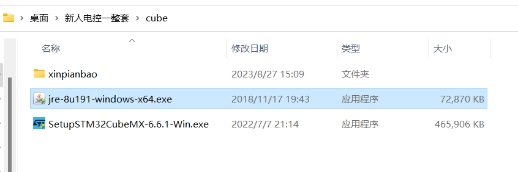

2. 勾选 **更改目标文件夹**，然后点击 **安装**。

    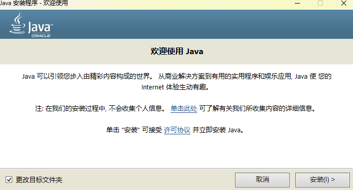

3. 在弹出的提示窗口中点击 **确定**。

    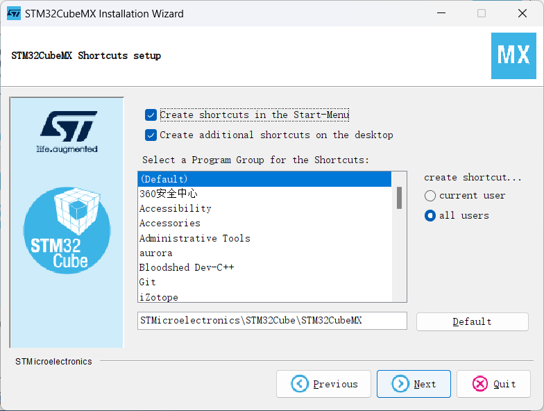

4. 点击 **更改**，选择合适的安装路径。建议安装到 C 盘以外的磁盘，例如 `D:\tools\java\jre1.8.0_191`。注意路径中不能含有中文。

    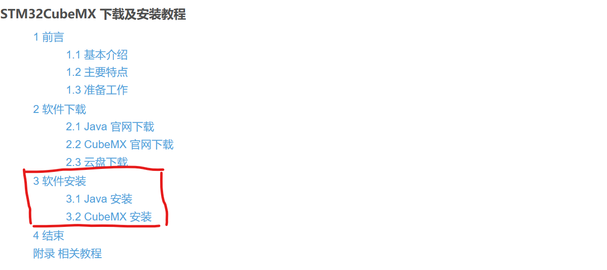

5. 确认安装路径后，点击 **下一步** 开始安装。

    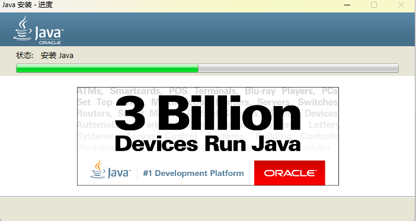

6. 安装完成后，点击 **关闭**。

    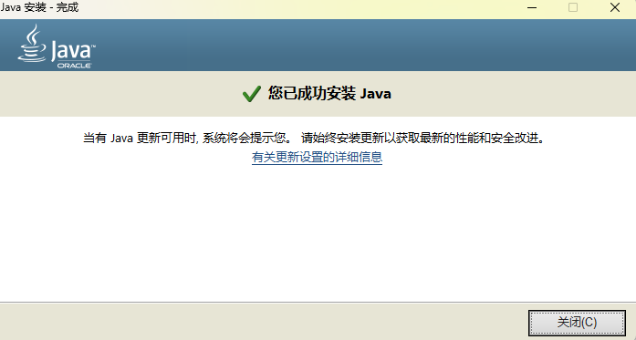

## 安装 STM32CubeMX

1. 打开 `cubemx` 文件夹，双击运行 `SetupSTM32CubeMX-6.6.1-Win` 安装程序。

    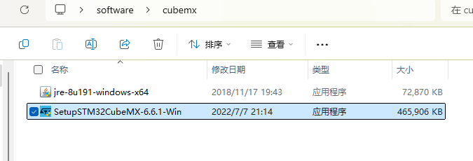

2. 点击 **Next**。

    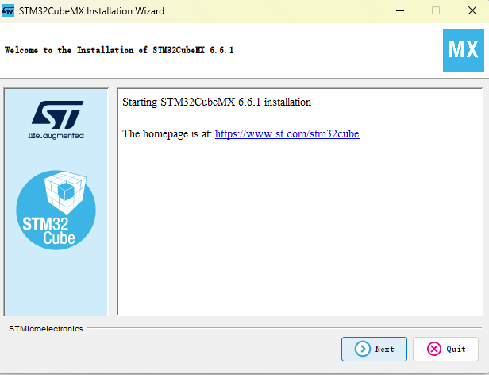

3. 勾选 **I accept the terms of this license agreement**，然后点击 **Next**。

    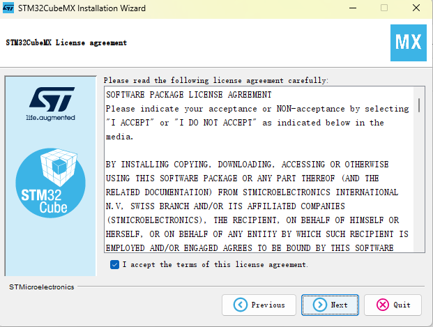

4. 勾选 **I have read and understood the ST Privacy Policy and ST Terms of Use**，然后点击 **Next**。

    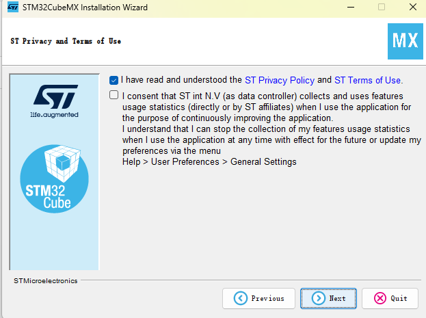

5. 点击 **Browse**，选择合适的安装路径。建议安装到 C 盘以外的磁盘，例如 `D:\tools\STMicroelectronics\STM32Cube\STM32CubeMX`。
注意路径中不能含有中文。
    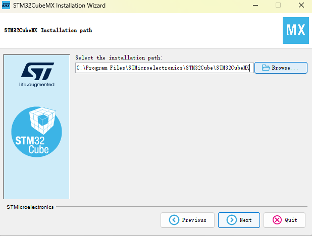

6. 如果目标文件夹尚不存在，请在弹出的提示窗口中点击 **确定**，创建该文件夹。

    > 本教程使用虚拟机进行演示，因此截图中的软件安装在 C 盘。实际安装时，建议选择其他磁盘。

    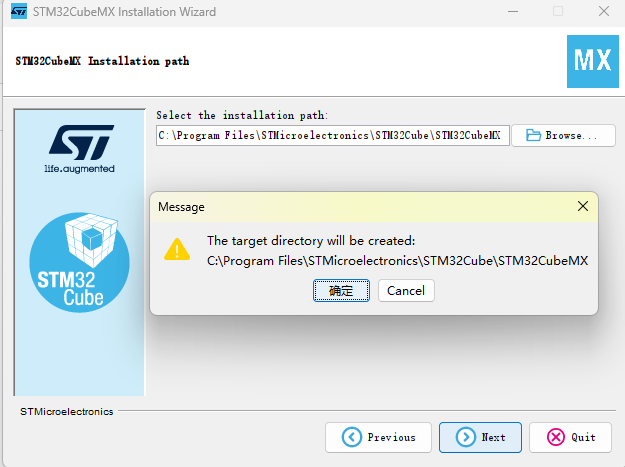

7. 确认安装设置后，点击 **Next** 开始安装。

    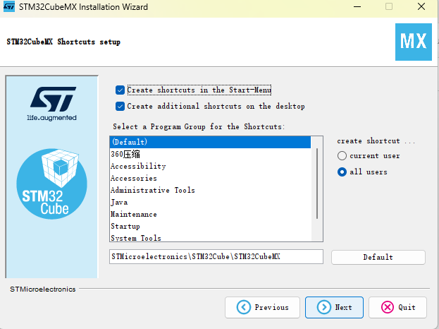

8. 等待安装完成，然后点击 **Next**。

    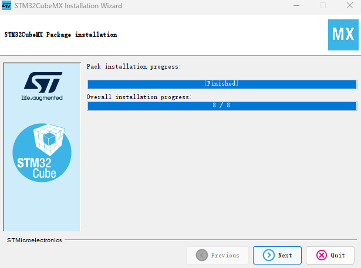

9. 点击 **Done** 退出安装向导。

    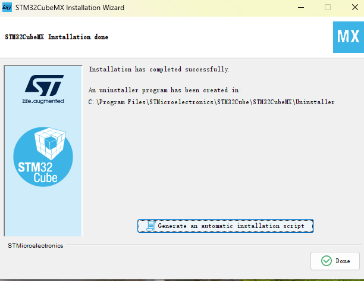

至此，STM32CubeMX 已安装完成。
