# Dev C++ 安装与使用教程

Dev C++ 是一款 Windows 下的轻量级 C/C++ 集成开发环境（IDE），完全免费，装完就能直接写 `main` 函数并按 F9 编译运行，适合 C/C++ 初学者。

Dev C++ 内嵌 GCC 的 Windows 版本 MinGW，支持 C++98 与 C++11 标准。相比 Visual Studio、CLion 和 Code::Blocks，它安装包小、启动快、自带编译器，适合教学、竞赛和算法训练。


## 下载 Dev C++

Dev C++ 的安装包已包含在课程提供的 `software` 压缩包中，请优先从 QQ 群文件中下载。若 QQ 群下载不便，也可通过[百度网盘（备用下载渠道）](https://pan.baidu.com/s/1PLoIJmeH33LL_dX_05VRsg?pwd=vc2z)下载，提取码：`vc2z`。

如需下载最新版本，可前往 [Dev C++ 官网](https://www.dev-cpp.com/)。

## 安装 Dev C++

参考：[【2026最新】Dev C++下载安装保姆级教程（附安装包+图文步骤）](https://zhuanlan.zhihu.com/p/1990875531034514231)

这里对其内容做简要摘录。

### 1. 加载安装程序

等待安装程序加载，通常只需要几十秒。


### 2. 选择安装语言

Dev C++ 支持多国语言，包括简体中文，但是要等到安装完成以后才能设置。安装过程中不能使用简体中文，这里选择 **English**。

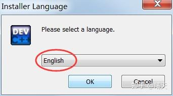

### 3. 同意许可协议

同意 Dev C++ 的各项条款。

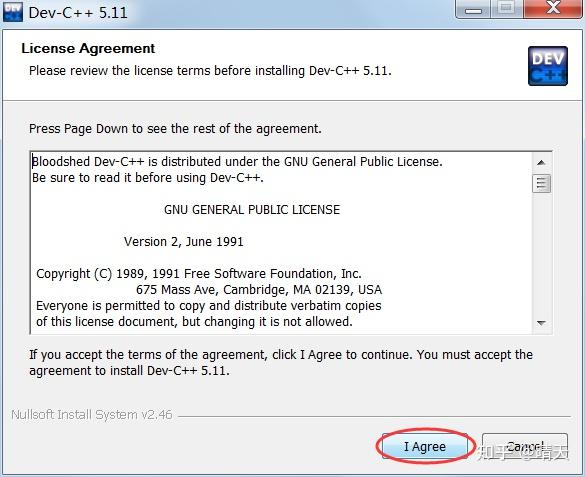

### 4. 选择安装组件

选择安装类型 **Full**，进行完整安装。

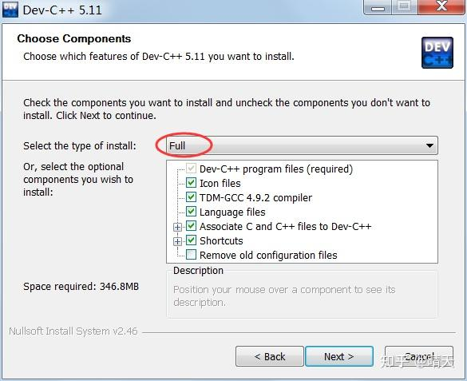

### 5. 选择安装路径

可以将 Dev C++ 安装在任意位置，但是路径中最好不要包含中文。

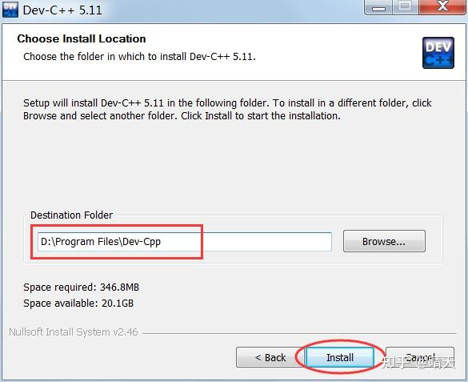

### 6. 等待安装

等待安装程序完成文件解压和安装。

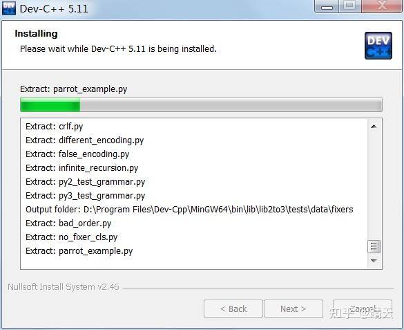

### 7. 安装完成

安装完成后点击 **Finish**。

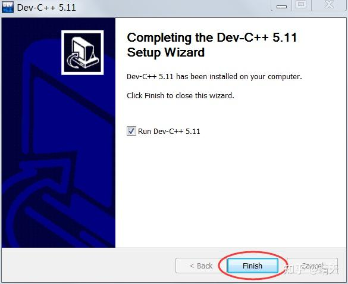

## 配置 Dev C++

首次使用 Dev C++ 还需要简单配置，包括语言、字体和主题风格。

### 1. 设置语言

第一次启动 Dev C++ 后，提示选择语言，这里选择 **简体中文/Chinese**。

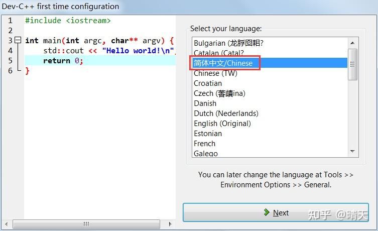

### 2. 设置字体和主题

选择字体和主题风格，保持默认即可。

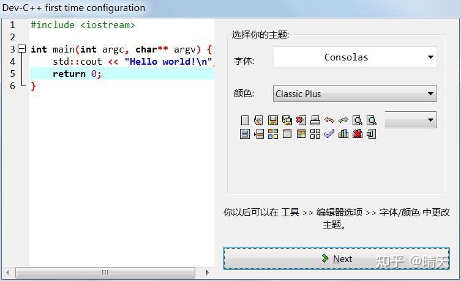

### 3. 完成配置

提示设置成功后，点击 **OK**，进入 Dev C++，即可编写代码。

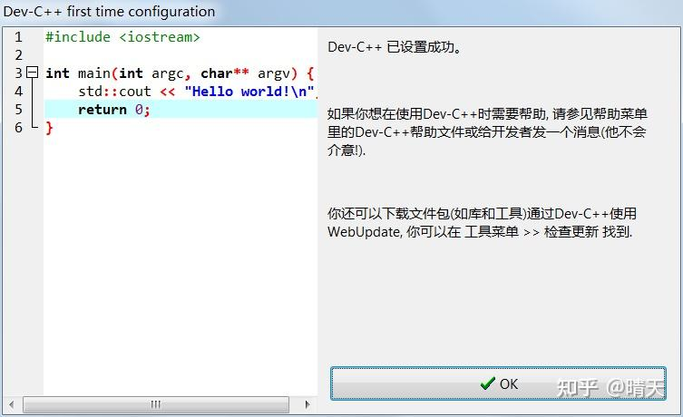

## 使用 Dev C++ 编写 C/C++ 程序

Dev C++ 支持单个源文件的编译。如果程序只有一个源文件，通常不用创建项目，直接运行即可；有多个源文件时才需要创建项目。

下面的 C 语言代码会在显示器上输出“Hello,World!”：

```c
#include <stdio.h>

int main()
{
    puts("Hello,World!");
    return 0;
}
```

### 1. 新建源文件

打开 Dev C++，在上方菜单栏选择“文件 → 新建 → 源代码”，或者按下 `Ctrl+N`，新建一个空白源文件。

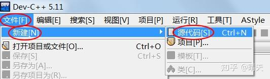

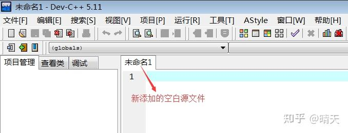

在空白文件中输入上面的代码。

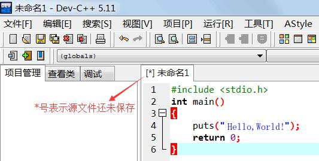

在上方菜单栏选择“文件 → 保存”，或者按下 `Ctrl+S`，保存源文件，注意将源文件后缀改为 `.c`。

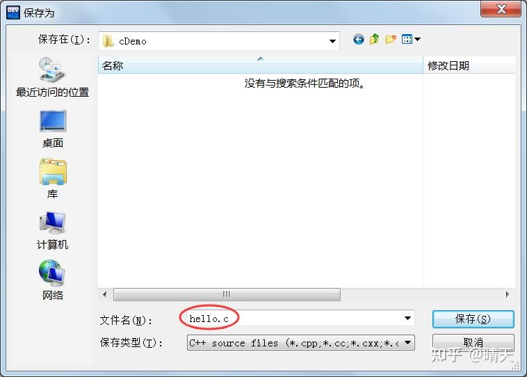

C++ 是在 C 语言基础上的扩展，C++ 已经包含 C 语言的全部内容。大部分 IDE 默认创建的是 C++ 文件，但只要把源文件后缀改为 `.c`，编译器就会根据后缀判断代码类型。上图中，源文件命名为 `hello.c`。

### 2. 生成可执行程序

在上方菜单栏选择“运行 → 编译”，或者直接按下 `F9`，完成 `hello.c` 的编译。

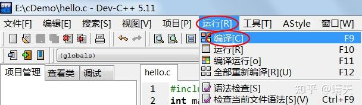

如果代码没有错误，可以在下方的“编译日志”窗口中看到编译成功的提示。

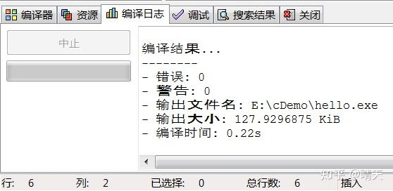

编译完成后，打开源文件所在的目录（本教程中是 `E:\\cDemo\\`），会看到一个名为 `hello.exe` 的文件，这就是最终生成的可执行文件。

Dev C++ 将编译和链接两个步骤合二为一，统称为“编译”，并且在链接完成后删除目标文件，所以看不到目标文件。

双击 `hello.exe` 运行时，黑色窗口可能一闪而过。这是因为程序输出“Hello,World!”后就运行结束，窗口会自动关闭。

如果希望程序输出后暂停，可以修改为：

```c
#include <stdio.h>
#include <stdlib.h>

int main()
{
    puts("Hello,World!");
    system("pause");
    return 0;
}
```

`system("pause");` 会让程序暂停。注意代码开头还要添加 `#include <stdlib.h>`，否则 `system("pause");` 无效。

再次编译并运行生成的 `hello.exe`，即可看到输出结果。按下键盘上的任意一个键，程序就会关闭。

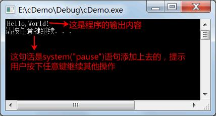

### 3. 更便捷地运行程序

实际开发中，一般使用菜单中的“编译 → 编译运行”，或者直接按下 `F11`，一键完成“编译 → 链接 → 运行”，不必再到文件夹中找到可执行程序。

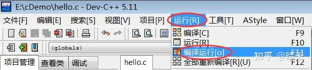

这样做的另一个好处是，编译器会让程序自动暂停，不需要再添加 `system("pause");`。删除这条语句后，按下 `F11` 再次运行即可。

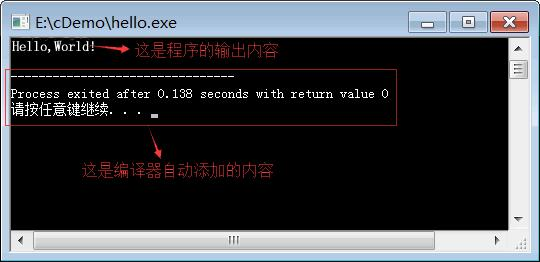

现在可以将 `hello.exe` 分享给朋友，告诉他们这是你编写的第一个 C 语言程序。


