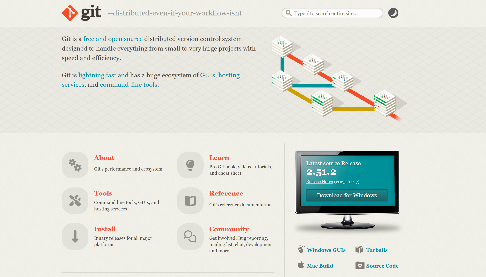
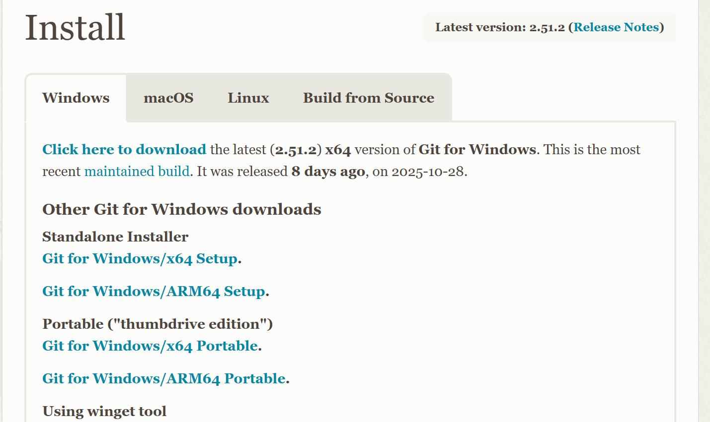
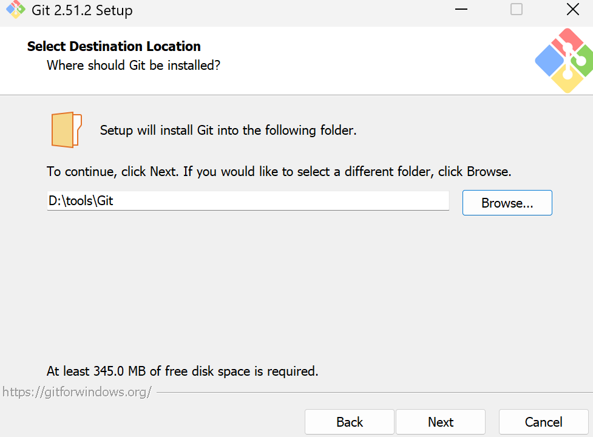
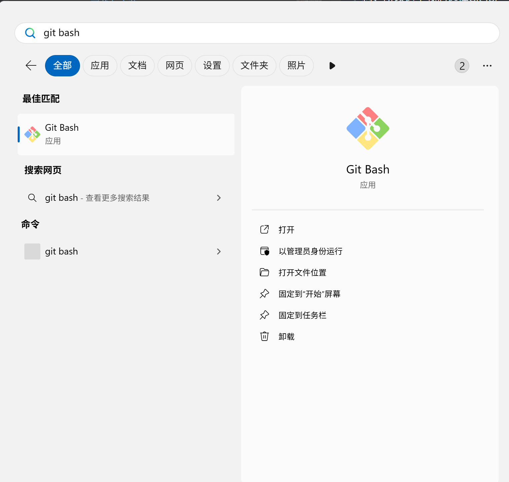
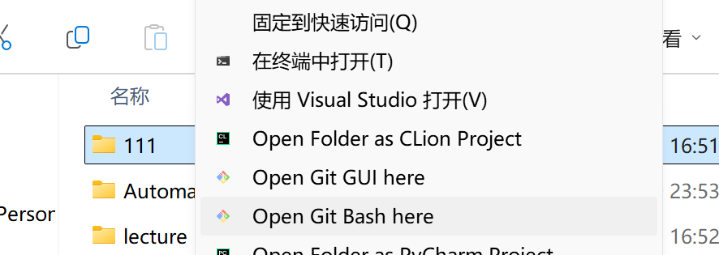
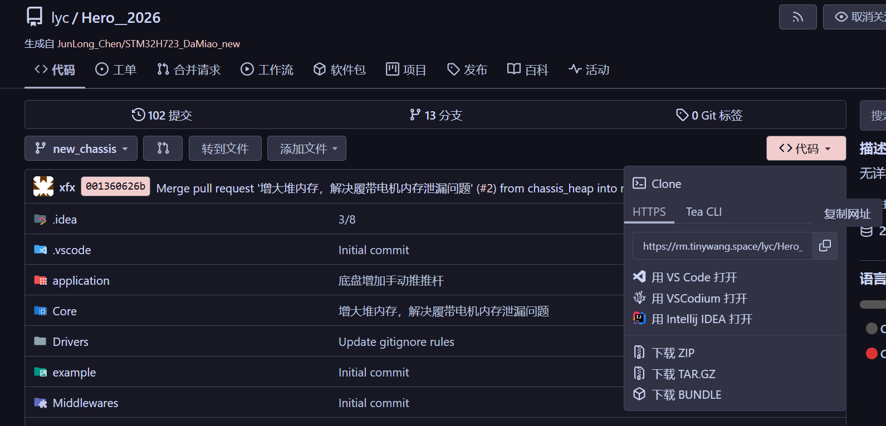
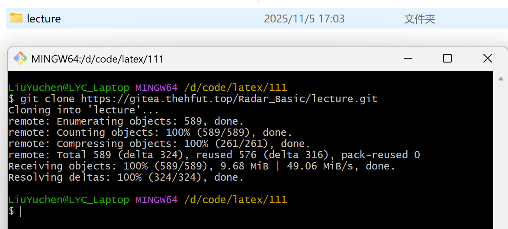

# Git 下载、安装与初始配置

Git 是一个分布式版本控制工具，可以记录代码的修改历史，也可以从 GitHub、Gitee 或队内 Gitea 等平台下载和同步工程。本教程以 **Windows 11（x64）** 为例，完成 Git 的下载、安装、个人信息配置和第一次代码克隆。

## 下载 Git

课程提供的“software”压缩包中已经包含 Git 安装包，可以解压后直接使用。如需下载最新版本，请按照下面的步骤前往 Git 官网下载。

1. 打开 [Git 官网](https://git-scm.com/)，点击页面中的 **Download for Windows**。

    

2. 在下载页面选择适合电脑的安装包。绝大多数使用 Intel 或 AMD 处理器的电脑选择 **Git for Windows/x64 Setup**；只有 Windows on ARM 设备才选择 ARM64 版本。

    

3. 等待安装程序下载完成。下载速度较慢时，可以切换网络后重试。

    

## 安装 Git

1. 双击下载的 `.exe` 文件启动安装程序。如果 Windows 弹出安全确认窗口，确认安装包来自 Git 官网后，点击 **是**。

2. 选择安装路径。建议使用默认路径；如需修改，尽量避免中文、空格和特殊字符。确认后点击 **Next**。

    

3. 后续选项保持默认并依次点击 **Next**，最后点击 **Install**。安装完成后点击 **Finish**。

## 检查安装并配置个人信息

1. 在 Windows 搜索框中输入 `Git Bash`，打开 Git Bash。

    

2. 输入以下命令检查 Git 是否安装成功：

    ```bash
    git --version
    ```

    如果终端输出类似 `git version 2.x.x.windows.x` 的版本信息，说明安装成功。

3. 配置提交代码时使用的姓名和邮箱。请将引号中的内容替换为自己的信息：

    ```bash
    git config --global user.name "Your Name"
    git config --global user.email "email@example.com"
    ```

4. 输入以下命令检查配置结果：

    ```bash
    git config --global --get user.name
    git config --global --get user.email
    ```

> **说明：姓名与邮箱的作用**
>
> 这两项信息会记录在以后创建的 Git 提交中。若主要使用 GitHub、Gitee 或队内 Gitea，建议填写对应平台使用的姓名和邮箱。

## 克隆第一个代码仓库

“克隆”就是把远程仓库中的代码完整下载到本地，并保留后续同步代码所需的信息。

1. 新建一个用于保存工程的文件夹。进入该文件夹，在空白处右击，选择 **Open Git Bash here**。如果 Windows 11 的右键菜单中没有显示该选项，先点击 **显示更多选项**。

    

2. 在代码托管网站上打开需要下载的仓库，点击 **代码** 或 **Clone**，选择 **HTTPS**，然后复制仓库网址。

    

3. 回到 Git Bash，输入 `git clone`，后面粘贴刚才复制的网址。例如：

    ```bash
    git clone https://example.com/group/project.git
    ```

4. 按下 Enter，等待下载完成。当终端出现 `done` 且不再显示报错时，可以在当前文件夹中看到新下载的工程目录。

    

### 常见问题

- 提示 `git: command not found`：关闭并重新打开终端；仍无效时，重新安装 Git 并保持默认的环境变量选项。
- 下载长时间没有进度：检查网络连接和仓库网址，然后重新执行命令。
- 提示需要登录或无权限：确认自己已拥有该仓库的访问权限，并按网站提示登录或使用访问令牌。

至此，Git 已完成安装和基础配置。想进一步学习提交、分支、合并等操作，可以阅读本站的 [Git 与工程化](git.md)，也可以参考官方免费电子书 [Pro Git（中文版）](https://git-scm.com/book/zh/v2)。
