# 安装 Keil 5

## 准备安装文件

安装所需的 `software` 压缩包请优先从 QQ 群文件中下载。若 QQ 群下载不便，也可通过[百度网盘（备用下载渠道）](https://pan.baidu.com/s/1PLoIJmeH33LL_dX_05VRsg?pwd=vc2z)下载，提取码：`vc2z`。

下载并解压 `software` 压缩包后，打开其中的 `keil` 文件夹。

## 安装 MDK

1. 运行 `MDK535.EXE`。

    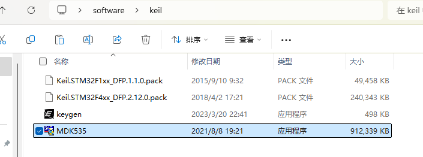

2. 在弹出的界面中点击 **Next**。

    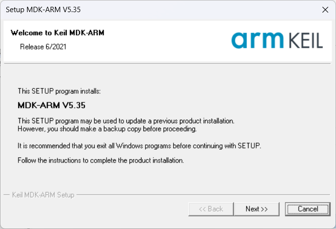

3. 勾选 **I agree**，点击 **Next**。

    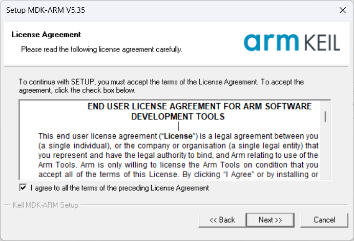

4. 记住界面中的默认安装路径，然后点击 **Next**。注意：

    - 安装路径中不要有中文。
    - 不要安装在 `C:\Program Files` 文件夹中。
    - 如需更改安装位置，点击右侧的 **Browse**。更改后要记住新的安装位置，Core 和 Pack 的位置都要记住。

    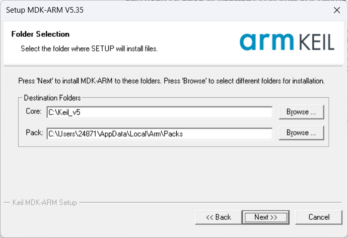

5. 填写用户信息，内容可以随便填写，然后点击 **Next**。

    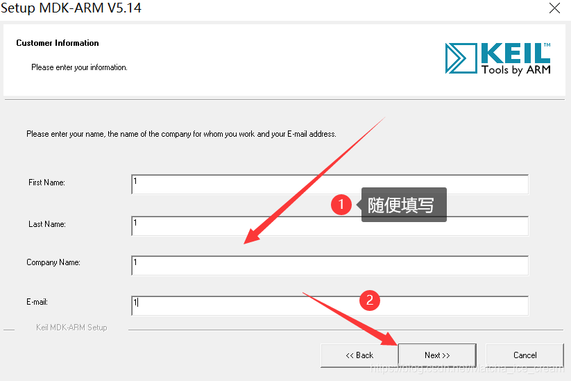

6. 等待 Keil 5 安装完成。

    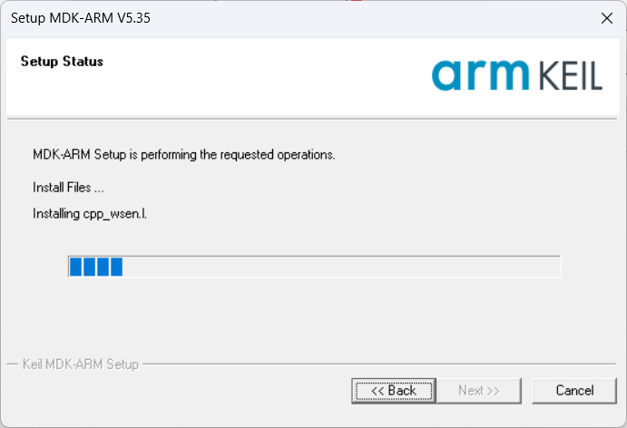

7. 安装完成后，在弹出的界面中点击 **Finish**。

    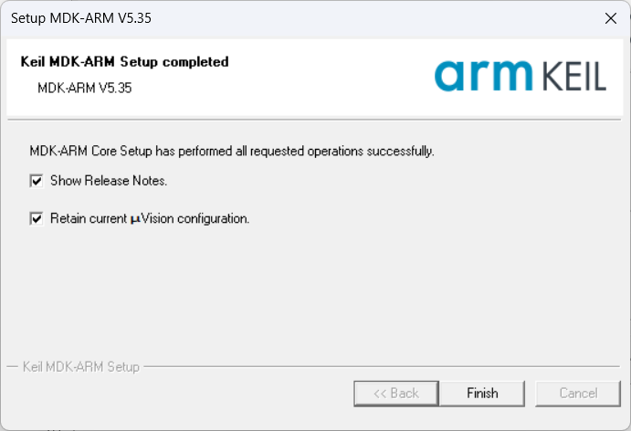

8. 关闭随后弹出的 **Pack Installer** 窗口。

    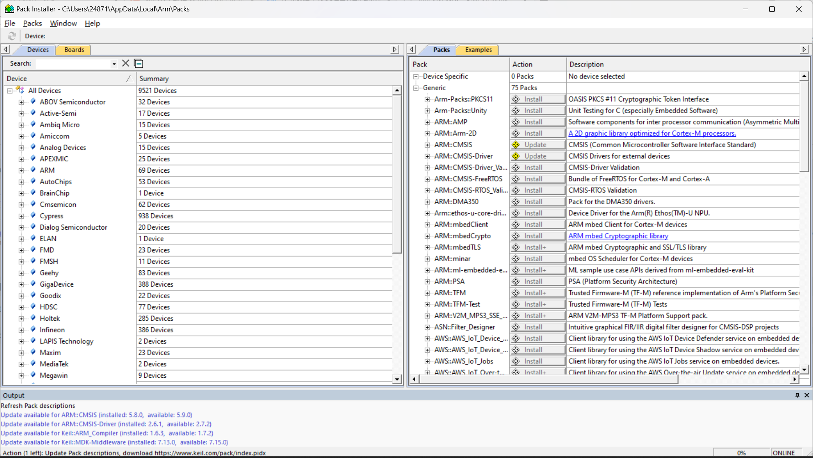

## 激活 MDK

1. 在桌面上右击 Keil 图标，选择 **以管理员身份运行**。这一步很重要。

    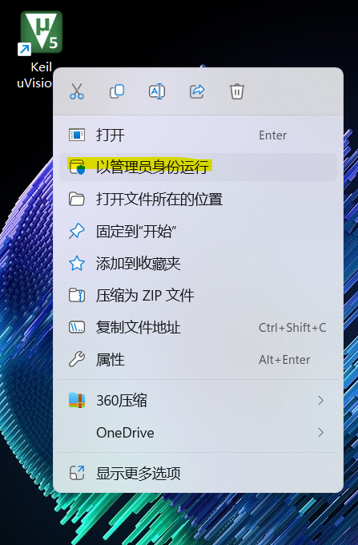

2. 点击 **File**，选择 **License Management**。

    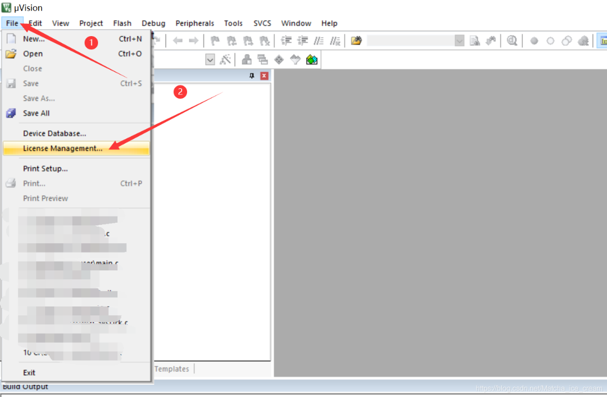

3. 复制 CID。

    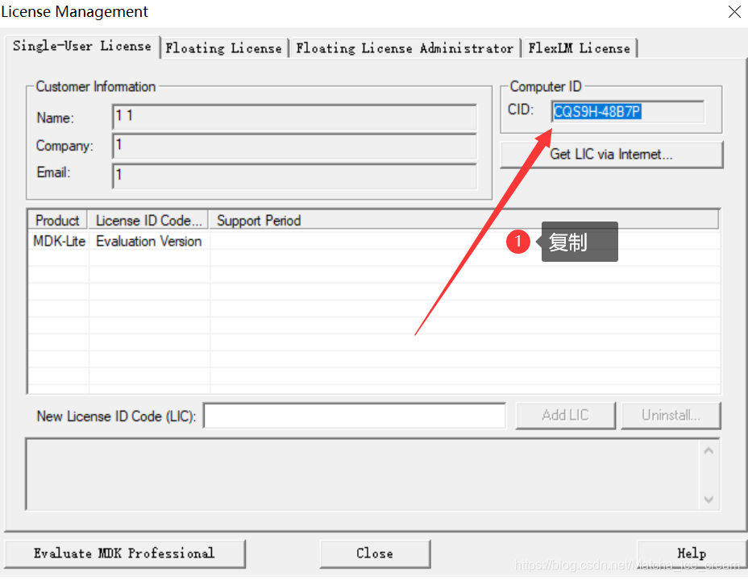

4. 在安装文件中运行 `keygen.exe`。运行前一定静音；喜欢刺激的同学可以把声音调到最大。

    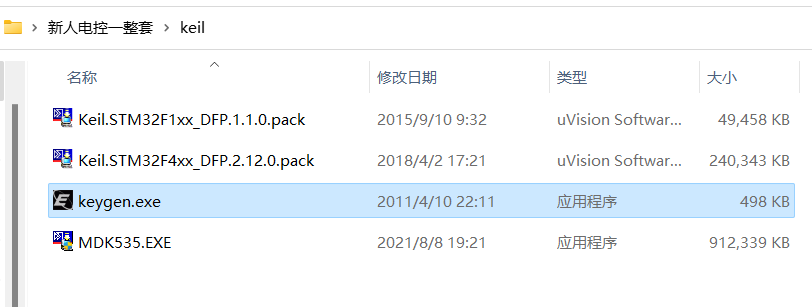

5. 粘贴复制的 CID，将 **Target** 设为 **ARM**，点击 **Generate** 生成激活码。

    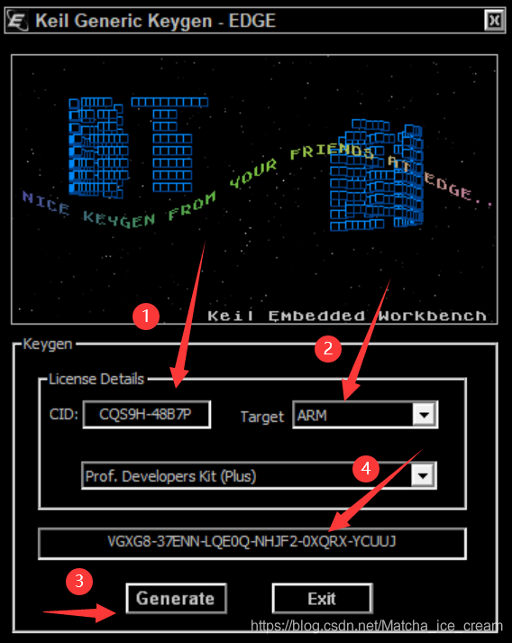

6. 复制生成的激活码，粘贴到 **New License ID Code**，点击 **Add LIC**。激活成功后会显示 MDK 的使用期限。

    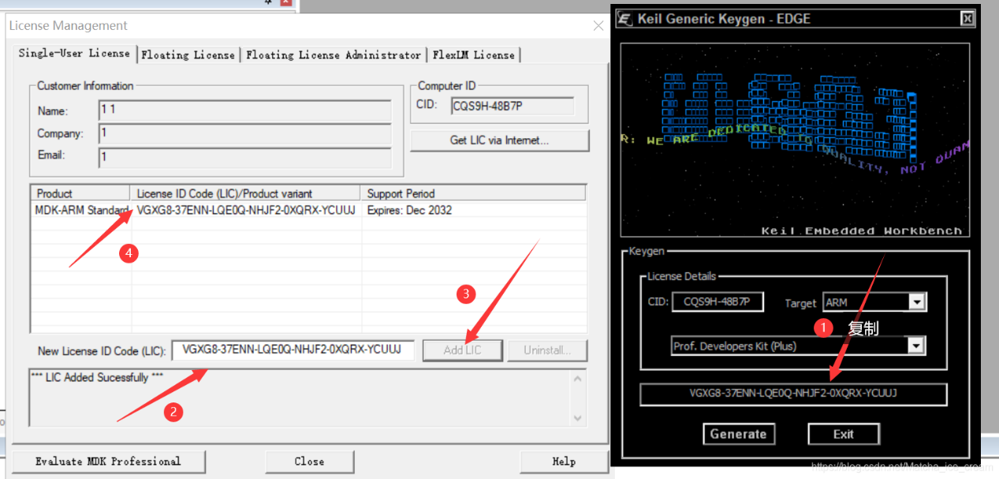

## 安装 STM32F1 设备支持包

1. 在安装文件中运行 `Keil.STM32F1xx_DFP.1.1.0.pack`。

    

2. 点击 **Next** 开始安装；安装完成后点击 **Finish**。

    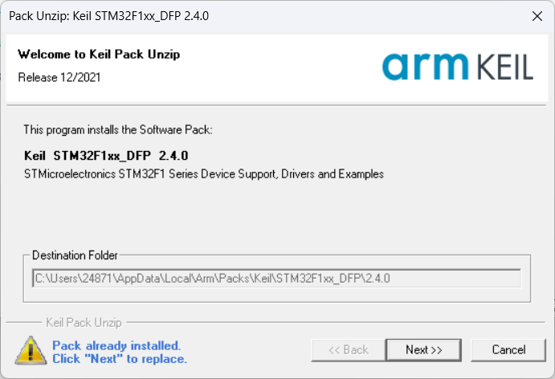

    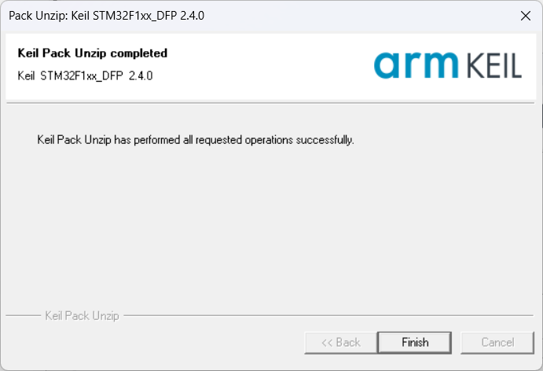

至此，Keil 5 已成功安装并激活。
