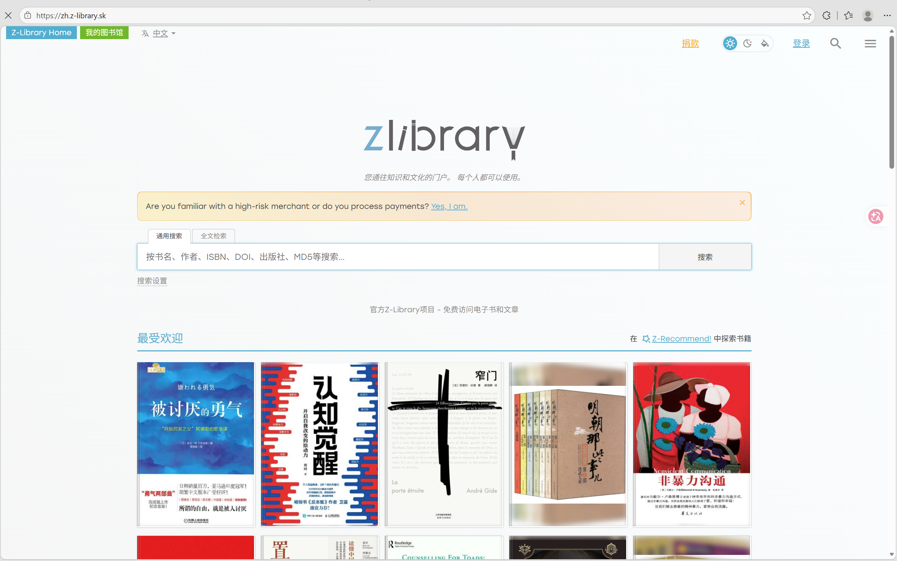

# 如何寻找资源

工程师的第一项能力是会找资料。遇到问题按"官方文档 → 教程视频 → 社区讨论 → 搜索引擎"的顺序查找，效率最高。本章整理各平台的入口与使用建议。

## 视频平台

- [Bilibili](https://www.bilibili.com) — 电控学习的主流视频来源。搜索时认准高播放量、系列完整的 UP 主（江协科技、野火、正点原子等），避免零散片段。

## 图文社区

- [CSDN](https://www.csdn.net) — 嵌入式博客数量最多的中文社区，报错排查、配置教程覆盖面广，注意甄别质量
- [知乎](https://www.zhihu.com) — 适合找经验帖，有很多高质量博主，也有很多低质内容。。。
- [菜鸟教程](https://www.runoob.com) — 语法速查方便，适合快速入门与复习
- [CS Self-learning](https://csdiy.wiki) — 计算机自学课程指南，公共基础资源整理完善
- [野火电子文档中心](https://doc.embedfire.com) — STM32、FreeRTOS、电机控制等系列教程免费在线阅读，配套视频齐全
- [正点原子官网](http://www.alientek.com) — 资料下载中心例程丰富，开发板教程体系完整

## 代码与开源

- [GitHub](https://github.com) — 不必多言，全球最大开源社区
- [RoboMaster 论坛](https://bbs.robomaster.com) — 各战队开源方案与经验帖集中地，RM 专属问题优先来这找。

## 官方渠道

- [RoboMaster 规则 / 资料中心](https://bbs.robomaster.com/wiki/20204847) — 规则手册、开发板用户手册、电调说明书等官方文档的权威入口。
- 芯片手册（Datasheet / 参考手册）一律从芯片原厂官网下载，这是解决外设问题的最终依据。

## 电子书

电子版可通过 **Zlibrary** 获取。该站域名时常更换，直接搜索"Zlibrary"或其镜像站即可；条件允许建议支持纸质正版。

{: style="zoom:25%" }

> PS：这里甚至可以下到各种学校指定书籍教材的电子版
