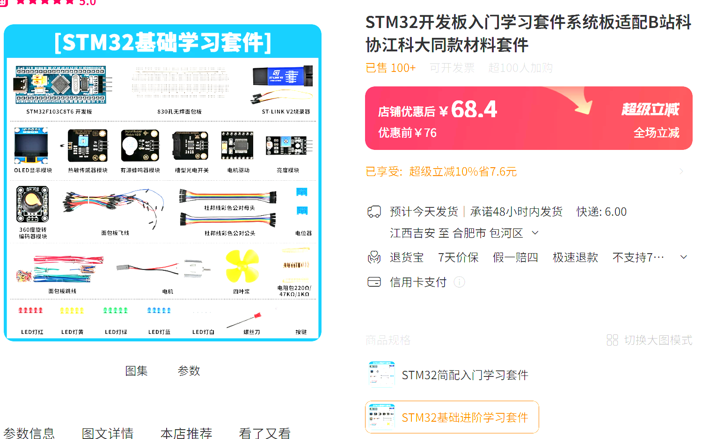

# STM32 开发基础

目前来说，STM32 是最常见的单片机型号，贯穿出现在大学大部分竞赛，以及市面上的电子产品。单片机外设（GPIO、中断、定时器、DMA）是嵌入式开发的核心基础，也是后面通信、RTOS、电机控制各章的前置。

这里解答如下疑问：

* 要不要先学51单片机？——不需要，可以直接上手32位单片机，如果想从低位简单的单片机开始可以了解，但不建议花时间
* 标准库还是HAL库？——ST公司早已遗弃了标准库，大力推广其HAL库，这里依旧建议直接学习HAL库（播放量最高的江科大教程依旧使用的是标准库，这里看个人情况，学习标准库配置对于外设配置和驱动代码的理解还是有一定好处的）

## 环境配置

- [**STM32CubeMX**](https://www.st.com/en/development-tools/stm32cubemx.html) — ST 官方图形化配置工具：点选外设、生成 HAL 库初始化工程，官方例程也基于此。
- [**Keil MDK5**](https://www.keil.com/mdk5/) — 传统单片机 IDE，配套教程资料最多。

keil的软件资源下载可见"如何配置软件环境"这一节内容

## 视频教程

B站搜索关键词STM32+HAL库寻找即可，这里推荐几个：

[【keysking】第0集 超易懂的STM32教程！！](https://www.bilibili.com/video/BV12v4y1y7uV?vd_source=0ec807ca37217dda15dcd3c1863ba0c9)_

[铁头山羊stm32 入门教程【新版】](https://www.bilibili.com/video/BV11X4y1j7si?vd_source=0ec807ca37217dda15dcd3c1863ba0c9)

[【中科大RM电控合集】手把手Keil+STM32CubeMX+VsCode环境配置](https://www.bilibili.com/video/BV1bU4y1D7nJ?vd_source=0ec807ca37217dda15dcd3c1863ba0c9)

## 开发板购买须知

注意，不建议买教程各家的系统板，还是建议买类似stm32最小核心系统板这种，**但注意要买原装STM32，有些卖家卖的是国产，虽然能用，但初学者可能会遇到意料之外的麻烦**，然后买常见的外设模块，目的是学会接线连接引脚，这一部分挺重要的，对于迁移到其他芯片和环境的能力也有培养，而不是导致我只会用某一种板子的现象。最重要的是不需要买一两百的学习套件，大部分其实用不到，**嫌麻烦就买五六十带简单模块和stm32最小系统板的学习套件即可**。

【淘宝】假一赔四 https://e.tb.cn/h.8o29w43IyKgv8Wf?tk=LOrtTUaoZPo CZ356 「江科大STM32开发板套件103C8T6系统板面包板核心板入门江协科技电」
点击链接直接打开 或者 淘宝搜索直接打开

## HAL 库与官方文档

- CubeMX 生成的工程自带 HAL 库源码，函数用法看.h源码注释或工程内说明文档。
- 芯片参考手册，遇到疑难时查阅，可从 ST 官网获取，但大多是全英文，可以找相关的中文手册资源。

这里附上Robomaster官方C板（MCU型号为STM32F407IG）的教程文档：

[RoboMaster/Development-Board-C-Examples](https://github.com/RoboMaster/Development-Board-C-Examples/tree/master)

## 学习建议

每个外设学完务必在实板上验证，不要停留在仿真。学会外设和常见通信协议之后，可以自己外接一些模块进行二次开发了
