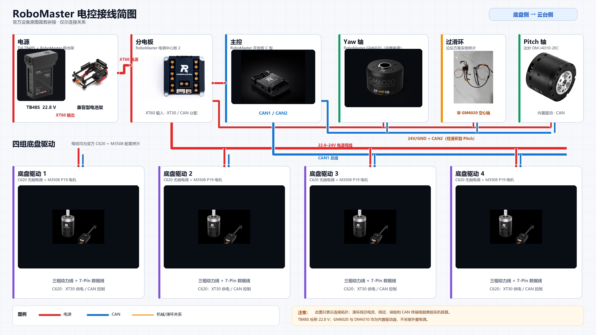
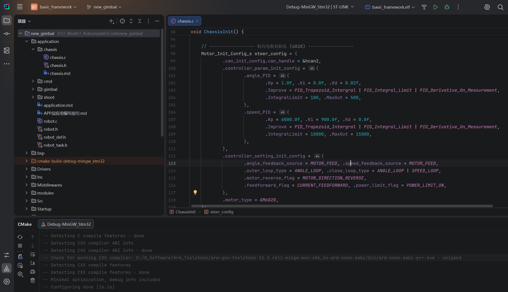
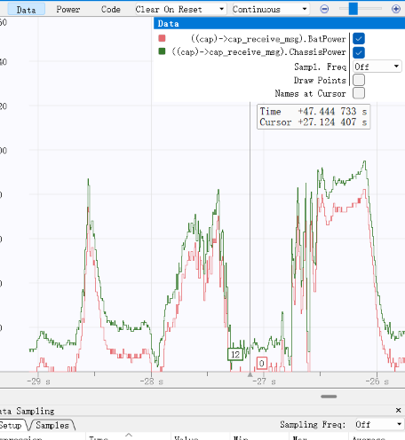
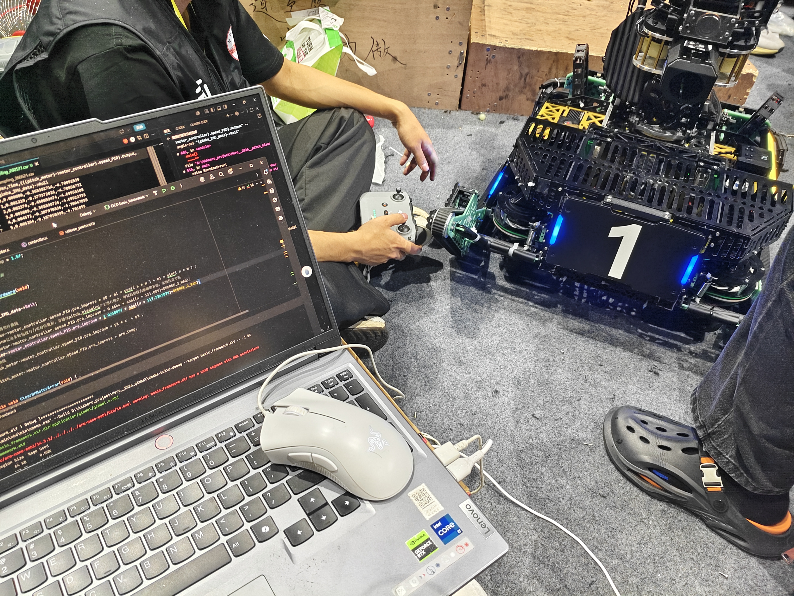
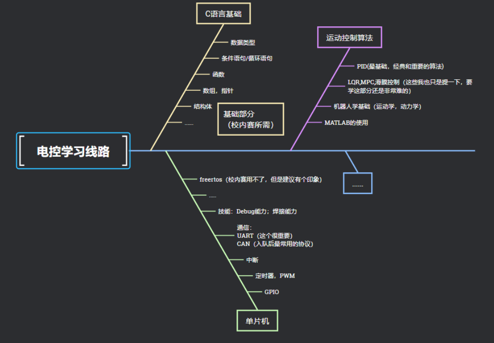
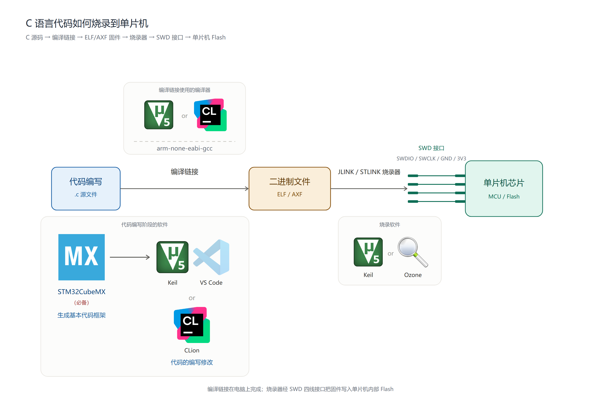
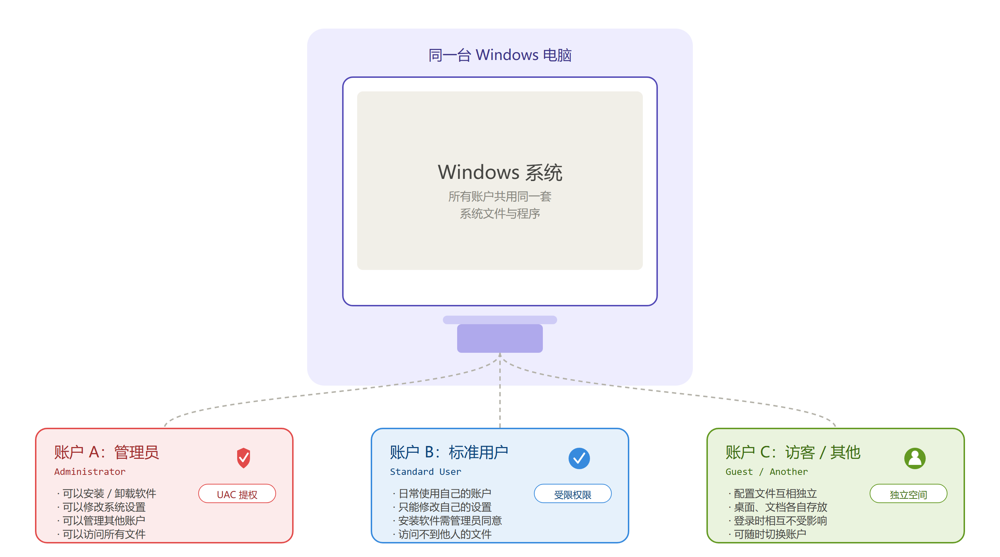
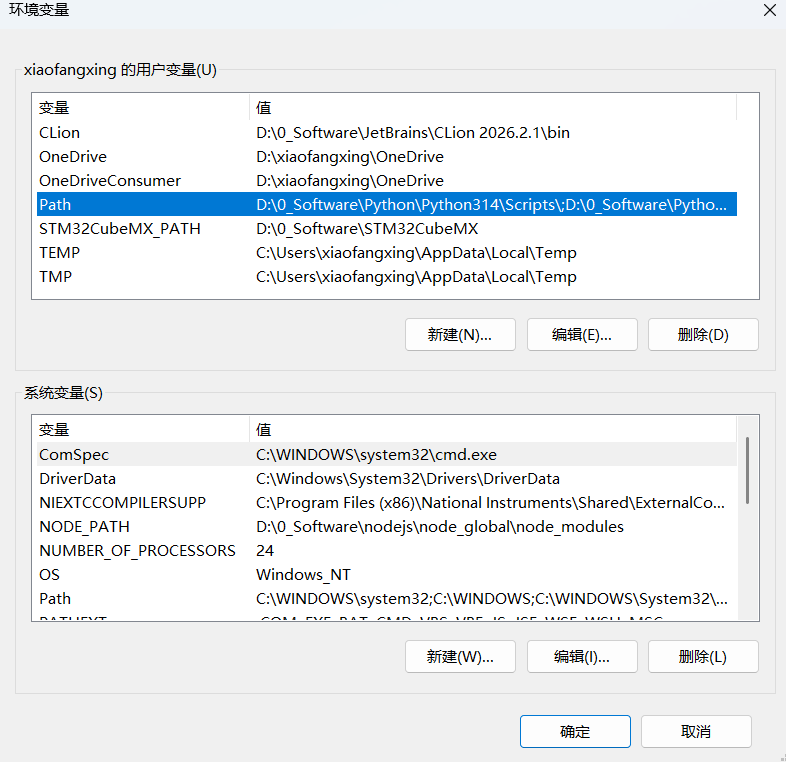
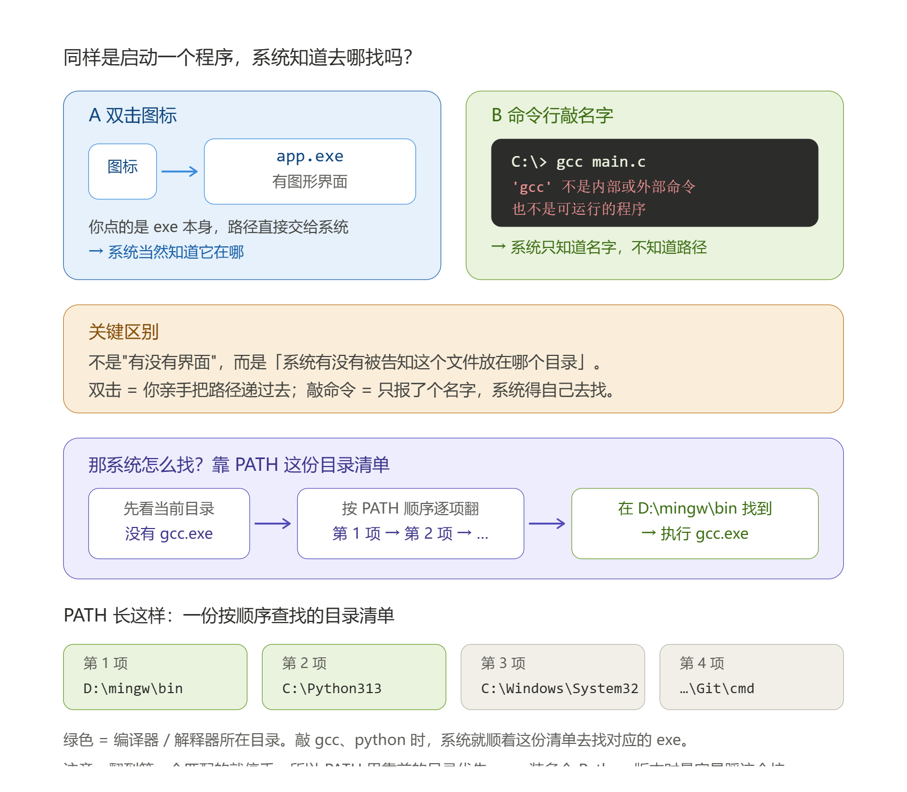
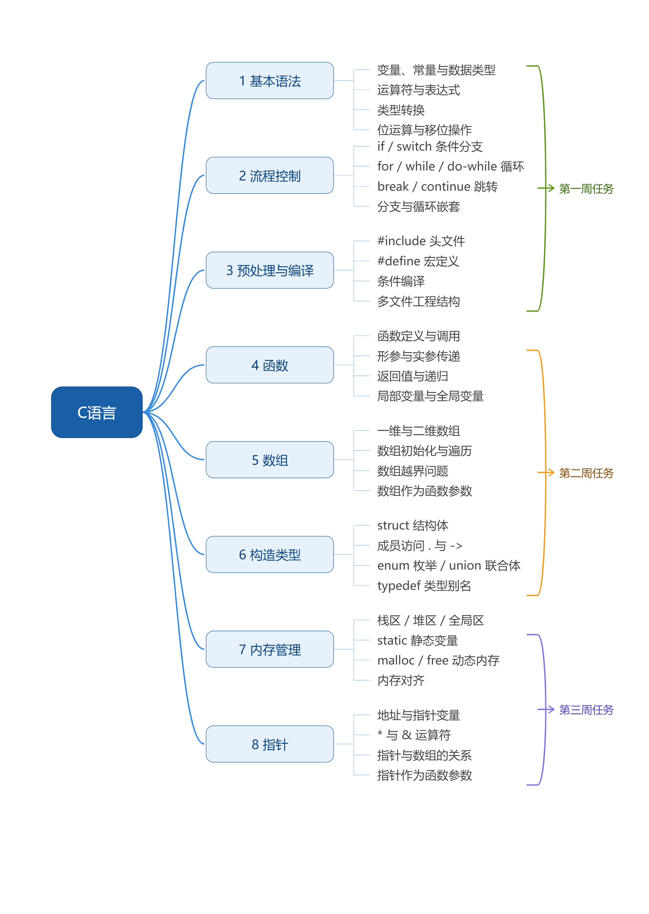

# 第一次培训

> 回放视频：[【HFUT苍穹机甲大师27电控组第一次培训】](https://www.bilibili.com/video/BV1fShy6iEPb?vd_source=0ec807ca37217dda15dcd3c1863ba0c9)

## 一、RoboMaster 比赛介绍

- RM 官网：https://www.robomaster.com/zh-CN
- 规则介绍：[RMUC 2026 机甲大师超级对抗赛·规则视频](https://www.bilibili.com/video/BV1gjdGB4Eba?vd_source=0ec807ca37217dda15dcd3c1863ba0c9)
- 机器人与兵种介绍：https://www.robomaster.com/zh-CN/robo/rm
- 规则 / 资料中心：https://bbs.robomaster.com/wiki/20204847

### 电控组在比赛里做什么

简而言之，就是有了机械做的实物，我们如何让其"动"起来

这里，就涉及到：

- 主控程序：底盘、云台、发射机构的控制逻辑
- 电机闭环控制：PID、前馈
- 传感器与通信：IMU、遥控器、CAN 总线电调、与视觉上位机的串口协议
- 裁判系统对接与电源管理

这里，就会涉及到关于**编程语言、嵌入式、控制、电气硬件、机器人学**等相关的知识









---

## 二、技术栈

| 技能 | 内容 | 对应教程章节 |
|------|------|--------------|
| C 语言 | 指针、内存、结构体、编译链接——一切的地基 | C 语言学习 |
| 单片机 | STM32 外设：GPIO / 中断 / 定时器 / DMA | STM32 开发基础 |
| 通信 | UART / I2C / SPI / CAN | 通信协议 |
| 模块 | IMU、电机驱动、舵机、OLED、蓝牙 | 常用模块 |
| RTOS | FreeRTOS 任务 / 队列 / 信号量 | RTOS |
| 电机控制 | PID 位置式/增量式/串级、前馈控制 | 电机控制 |
| 工具链 | CLion / VSCode+Keil、Ozone+J-Link 调试 | 开发方式、调试方法 |
| 硬件调试 | 万用表、焊接、示波器 | 硬件调试 |

---

## 三、学习路线指导



### ！！！怎么用我们的教程网站

- ==**主站：https://xiaofxx.github.io/rm-ec-training/**==
- ==**镜像（打不开主站时用）：https://rm-ec-training.pages.dev/**==

---

## 四、环境配置环节

关于软件的讲解，

前期会发现很多人甚至下错软件，也有很多人对这些软件是做什么的一头雾水

这里统一一下口径，如下所示：

---

### C 语言阶段

#### Dev-C++

这里只建议 **Dev-C++**，省去配编译器等环节

#### VS Code

当然你想用 **VS Code** 也是推荐的，不过最好有能力自己搞懂插件、编译器如何配置

---

### 单片机学习阶段

先讲解一下电控调车、烧代码是个什么样的过程，再引申出对应的软件，你们可能更好理解



这里为了统一口径，只有两种方式：

#### 方式一：STM32CubeMX -> CLion -> Ozone

#### 方式二：STM32CubeMX -> Keil（~~VS Code~~）

关于 Keil 方式：由于考虑到很多教程、资源以及网站答疑都是通过 Keil，资源相对来说丰富，所以前期学习是推荐的

<u>至于为什么教程里面还有 VS Code</u>，这个是由于 Keil 编辑代码的体验并不是很好，所以建议用 VS Code 进行编辑代码，当然你只用 Keil 也是可以的

关于到底选用哪种，这里我们也给不出绝对的推荐，

因为 CLion + Ozone 的方式是非常方便且现代的，队内目前也是这种方式，但配置环境和烧录略微麻烦，且还有 CMake 经常需要更新 CMakeLists

而 Keil 这种方式虽然界面远古、编辑体验不好，但其编译调试方面的强大，以及适配的芯片广泛，前期很多资料和教程包括例程都是用 Keil 写的，其在嵌入式的地位更不必多说

你当然可以全都要，但建议的方式是，**你<u>起码会用一点 Keil 而不至于不会用 Keil</u>。然后可以直接用 CLion**

---

> ==叽里呱啦没听懂，我到底该装什么？==
>
> ==省流：**Dev-C++，STM32CubeMX，CLion，Ozone**==

### 安装演示

==安装路径一定不能有中文==，==一些软件涉及破解，请关闭 Windows 安全防护中心、防火墙==

遇到任何问题，把报错代码复制粘贴到浏览器，别只会问 AI

这里进行一个演示，包括官网安装，以及神秘渠道、GitHub 甚至 Node.js（了解）等方式安装

### 拓展知识：

安装程序尽量都以**管理员身份**打开，避免不必要的报错



**以及什么是环境变量？**



大家下载的东西通常意义上都是软件，通过图标双击打开

大家有没有想过打开的是什么？

本质上打开的是一个 exe 可执行文件

那么对于编译器或者一些执行程序而言，他们只是一个 exe 文件，甚至没有图形化界面，那么系统或者其他软件去调用他们的时候，可以通过一个叫环境变量的东西去找到它们，然后执行



以 Python、gcc 等为例

那系统具体怎么找？它手里有一份**目录清单**，叫 PATH。敲下 `gcc` 的那一刻：

1. 系统先看看当前目录有没有 `gcc.exe`
2. 没有，就拿出 PATH，从第一项开始，逐个目录进去找 `gcc.exe`
3. 找到就执行；翻完所有目录都没找到，就报"不是内部或外部命令"

所以装完 Python 后，安装程序会问你"要不要 Add Python to PATH"。勾了，它就把 `C:\Python313\` 这个目录写进 PATH 清单——**从此你在任何目录下敲 `python`，系统都能顺着清单找到它。**没勾，就只能自己手动加，否则敲 `python` 就是那句报错。

```text
[ ] Add Python to PATH
```

> 没听懂？来个形象一点的演示：
>
> （演示用命令行启动 bilibili）

为什么需要加这个路径？

VS Code、CMake 这类本身不含编译器的工具，会主动去 PATH 里找你配好的编译器；而 Keil、STM32CubeIDE 这类自带完整工具链的 IDE，通常会在自己的设置里单独指定编译器路径，不依赖 PATH。

命令行运行 Python 脚本也是同理——敲 `python xxx.py` 时，系统就是从 PATH 里找到 `python.exe` 的

---

## 五、C 语言培训任务



**九月份一直持续到十月初咱们的重心都是以 C 语言为主**，很多同学已经开始学习单片机，值得鼓励，但前提是你的 C 语言基础一定要扎实，不然也只是跟着教程复制粘贴一步步啥也看不懂就点亮了个灯，所以前期 C 语言是非常重要的，不要尝试速成！也不需要攀比谁学的快

本次培训任务请完成第一周的任务，后续会发布题目

---

## 六、学习建议

### 前情提要：

在前几个赛季，电控组的培训形式都是通过直播 + B 站回放讲解知识点

[2026 赛季电控组第一次培训](https://www.bilibili.com/video/BV1nmJdz4Eff?vd_source=0ec807ca37217dda15dcd3c1863ba0c9)

但问题如下：

- 由于学长既要调车又要负责培训，讲解知识点备课无法花费大量时间，培训质量不能保证对齐市面上主流教程
- 很多入队电控成员当时也几乎不怎么看教程，而是 B 站进行自学
- 后期直播更是无人问津。。。

所以今年采取主张**自学知识点**，**通过培训跟踪指导进度**，以及通过**网站为主的形式**指导如何学内容

但还是说明一下我们的顾虑（同时也在这里征求意见）：

- 没有培训教程指导大概学习内容，很容易造成不知道往哪里学，或者不能统一进度，没有人催同时没有参与感会导致懈怠？
- 目前培训主要是指导为主，同时加上答疑，以及给出对应的培训任务

大伙是否可以接受？还是说更希望像往年一样带着讲知识点学 C 语言单片机之类的

### 建议

大家在前期学习的过程中，往往觉得困难，同时高中养成的某些思维学习方式并不利于当前你们掌握技术，前期会走很多弯路

这里只给出一句话：

==**需要什么学习什么，在实践当中学**==

### 关于提问

一定要**敢于提问，在群里提问**，不要怕被笑话（前提是你真的尝试解决了，而不是把学长学姐当成浏览器

如果真的社恐，准备加学长进行提问，那么做好如下准备：

- 学长在忙，没有第一时间解答你的疑问
- 你把学长当浏览器，有的学长不太想理你但还是回复了（微笑服务

当然，如果有关于疑问还是欢迎来提问的，比如关于个人规划，或者比赛以及奖学金，等等方面事情不方便在群里讲可以来和学长学姐讨论

当然，你在大量占用一个人的时间的时候，你得想好你能为这个人提供什么（不是指物质），你们相互的价值付出是否对等，不要骚扰式的大问特问（学长学姐还是很友好的）

很多时候你会发现学长学姐很冷漠，为什么？

（看我 QQ）

---

## 七、答疑环节

线下也有答疑哦 ~
